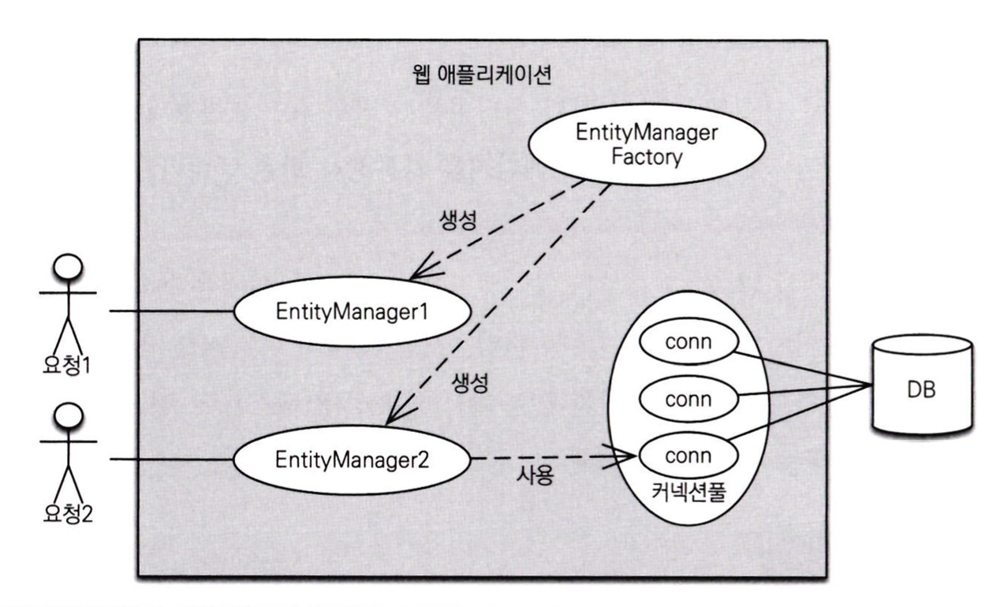

***엔티티 매니저는 엔티티를 저장, 수정, 삭제, 조회하는 등 엔티티와 관련된 모든 일을 처리한다.***

<br>
<hr>

# 엔티티 매니저 팩토리와 엔티티 매니저

DB를 하나만 사용하는 애플리케이션은 일반적으로 EntityManagerFactory를 하나만 생성한다.

EntityManagerFactory는 여러 스레드가 동시에 접근해도 안전하지만, EntityManager는 그렇지 않다.

```java
// EntityManagerFactory 생성, 비용이 큼
EntityManagerFactory emf = Persistence.createEntityManagerFactory(”jpabook");
```

이후로는 필요할 때마다 EntityManagerFactory에서 EntityManager를 생성하면 된다.

```java
EntityManager em = emf.createEntityManager();
```



<br>

> EntityManager는 DB 연결이 필요한 시점까지 커넥션을 얻지 않는다. (보통 트랜잭션을 사용할 때 커넥션을 획득) <br>
> 또한, 하이버네이트는 EntityManagerFactory를 생성할 때 커넥션풀도 만든다.

<br>
<hr>

# 영속성 컨텍스트

```java
em.persist(member);
```

EntityManager로 entity를 저장하거나 조회하면 EntityManager는 영속성 컨텍스트에 entity를 보관하고 관리한다. <br>
persist() 메서드는 엔티티 매니저를 사용해서 회원 엔티티를 영속성 컨텍스트에 저장해준다.

<br>
<hr>

# entity의 생명주기

엔티티에는 4가지의 상태가 존재한다.

### 비영속

엔티티 객체를 생성.

아직 저장하지 않았고, 영속성 컨텍스트나 DB와 전혀 관련 없다.

### 영속

엔티티 매니저를 통해 엔티티를 영속성 컨텍스트에 저장하거나, 조회한 상태.

**영속성 컨텍스트가 관리하는 엔티티를 영속 상태라고 한다**

### 준영속

영속성 컨텍스트가 관리하던 영속 상태의 엔티티를 영속성 컨텍스트가 관리하지 않는 상태.

em.detach()를 호출하거나, em.close(), em.clear()를 호출하면 영속 상태의 엔티티는 준영속 상태가 된다.

### 삭제

엔티티를 영속성 컨텍스트와 DB에서 삭제

<br>
<hr>

# 영속성 컨텍스트의 특징


