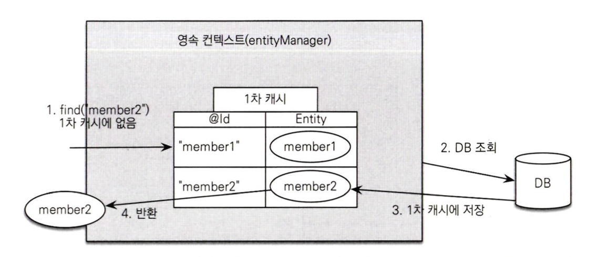
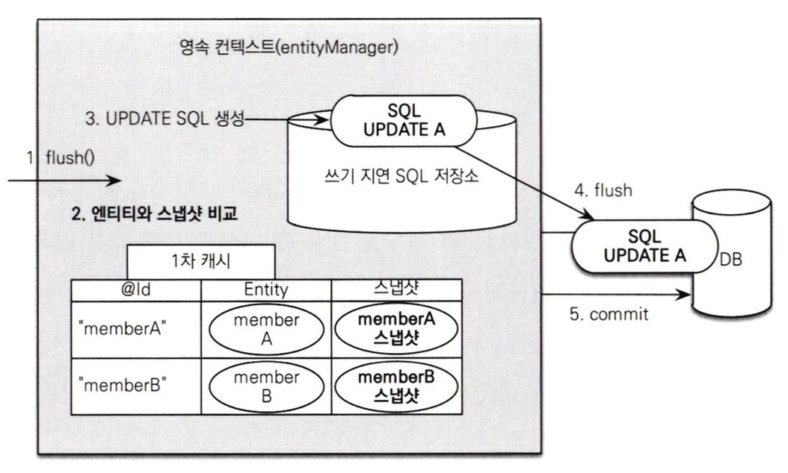

***엔티티 매니저는 엔티티를 저장, 수정, 삭제, 조회하는 등 엔티티와 관련된 모든 일을 처리한다.***

<br>
<hr>

# 엔티티 매니저 팩토리와 엔티티 매니저

DB를 하나만 사용하는 애플리케이션은 일반적으로 EntityManagerFactory를 하나만 생성한다.

EntityManagerFactory는 여러 스레드가 동시에 접근해도 안전하지만, EntityManager는 그렇지 않다.

```java
// EntityManagerFactory 생성, 비용이 큼
EntityManagerFactory emf = Persistence.createEntityManagerFactory(”jpabook");
```

이후로는 필요할 때마다 EntityManagerFactory에서 EntityManager를 생성하면 된다.

```java
EntityManager em = emf.createEntityManager();
```


<br>

> EntityManager는 DB 연결이 필요한 시점까지 커넥션을 얻지 않는다. (보통 트랜잭션을 사용할 때 커넥션을 획득) <br>
> 또한, 하이버네이트는 EntityManagerFactory를 생성할 때 커넥션풀도 만든다.

<br>
<hr>

# 영속성 컨텍스트

```java
em.persist(member);
```

EntityManager로 entity를 저장하거나 조회하면 EntityManager는 영속성 컨텍스트에 entity를 보관하고 관리한다. <br>
persist() 메서드는 엔티티 매니저를 사용해서 회원 엔티티를 영속성 컨텍스트에 저장해준다.

<br>
<hr>

# entity의 생명주기

엔티티에는 4가지의 상태가 존재한다.

### 비영속

엔티티 객체를 생성.

아직 저장하지 않았고, 영속성 컨텍스트나 DB와 전혀 관련 없다.

### 영속

엔티티 매니저를 통해 엔티티를 영속성 컨텍스트에 저장하거나, 조회한 상태.

**영속성 컨텍스트가 관리하는 엔티티를 영속 상태라고 한다**

### 준영속

영속성 컨텍스트가 관리하던 영속 상태의 엔티티를 영속성 컨텍스트가 관리하지 않는 상태.

em.detach()를 호출하거나, em.close(), em.clear()를 호출하면 영속 상태의 엔티티는 준영속 상태가 된다.

### 삭제

엔티티를 영속성 컨텍스트와 DB에서 삭제

<br>
<hr>

# 영속성 컨텍스트의 특징

- 식별자 값

> 영속성 컨텍스트는 엔티티를 식별자 값(@Id)으로 구분한다. <br>
> 따라서 영속 상태는 식별자 값이 반드시 있어야 한다.

<br>

- DB 저장

> JPA는 보통 트랜잭션을 커밋하는 순간 영속성 컨텍스트에 새로 저장된 엔티티를 DB에 반영(flush)한다.

<br>

- 영속성 컨텍스트가 엔티티를 관리할 때의 장점

1. 1차 캐시
2. 동일성 보장
3. 트랜잭션을 지원하는 쓰기 지연
4. 변경 감지
5. 지연 로딩

<br>

## entity 조회

영속성 컨텍스트는 내부에 캐시를 가지고 있는데 이를 1차 캐시라고 하고, 영속 상태의 엔티티는 모두 이곳에 저장된다. <br>
1차 캐시의 키는 식별자 값이다. 그리고 식별자 값은 DB 기본 키와 매핑되어 있다.

EntityManger.find() 메서드를 호출하면, 먼저 1차 캐시에서 엔티티를 찾고 없으면 DB에서 조회한다. <br>



## entity 등록

엔티티 매니저는 트랜잭션을 커밋하기 전까지 내부 쿼리 저장소에 INSERT SQL을 모아둔다. <br>
그리고 커밋할때 모아둔 쿼리를 DB에 보내는데 이를 **쓰기 지연**이라고 한다.

## entity 수정

JPA로 엔티티를 수정할 때는 엔티티를 조회 후 데이터만 변경하면 된다.



<br>

JPA는 엔티티를 영속성 컨텍스트에 보관하면서, 최초 상태를 복사해 저장해둔다 (스냅샷) <br>
그리고 플러시 시점에 스냅샷과 엔티티를 비교해서 변경된 엔티티를 찾는다. 변경된 엔티티가 있으면 update 쿼리를 DB로 날리고 커밋한다.

## entity 삭제

엔티티를 삭제하려면 엔티티를 조회한 후 em.remove()에 대상 엔티티를 넘겨주면 된다. <br>
em.remove(memberA)를 호출하는 순간 memberA는 영속성 컨텍스트에서 제거된다.

<br>
<hr>

# flush

**플러시는 영속성 컨텍스트의 변경 내용을 DB에 반영한다**

영속성 컨텍스트를 플러시 하는 방법은 3가지이다.

1. 직접 호출

엔티티 매니저의 flush()를 직접 호출한다.

<br>

2. 트랜잭션 커밋

JPA는 트랜잭션을 커밋할 때 플러시를 자동으로 호출한다.

<br>

3. JPQL 쿼리 실행

만약 memberA, memberB를 영속 상태로 만들고, JPQL로 이를 조회하려 하면 아직 DB에 없으므로 결과가 조회되지 않을 것이다. <br>
**JPA는 이를 방지하기 위해 JPQL을 실행할 때 플러시를 자동 호출한다.**

<br>
<hr>

# 준영속

영속 상태의 엔티티가 영속성 컨텍스트에서 detached된 것을 **준영속 상태**라고 한다.

영속 상태의 엔티티를 준영속 상태로 만드는 방법은 크게 3가지이다.

## detach()

em.detach()는 엔티티를 준영속 상태로 만든다. <br>
em.detach(memberA)를 실행하면 영속성 컨텍스트에 존재하는 memberA의 정보, SQL들이 모두 제거된다.

## clear()

em.clear()는 영속성 컨텍스트를 초기화해서 모든 엔티티를 준영속 상태로 만든다.

## close()

영속성 컨텍스트를 종료하면 영속 상태의 엔티티가 모두 준영속 상태가 된다.

<br>

## 준영속 상태의 특징

- 영속성 컨텍스트가 관리하지 않으므로 1차 캐시, 쓰기 지연, 변경 감지, 지연 로딩 등의 기능이 동작하지 않는다.
- 이미 한 번 영속 상태였으므로 식별자 값을 가지고 있다.
- 영속성 컨텍스트를 통해 데이터를 불러오는 지연 로딩을 할 수 없다.

## merge()

준영속 상태의 엔티티를 다시 영속 상태로 변경하려면 병합을 사용하면 된다. <br>
merge()는 준영속 상태의 엔티티를 받아 영속 상태의 엔티티로 반환한다.

동작 방식은 다음과 같다.

1. merge(member) 실행
2. 준영속 엔티티의 식별자 값으로 1차 캐시에서 엔티티 조회 (1차 캐시에 없으면 DB 조회 후 1차 캐시에 저장)
3. 조회한 엔티티(mergeMember)에 member 엔티티의 값을 넣는다.
4. memgeMember return


