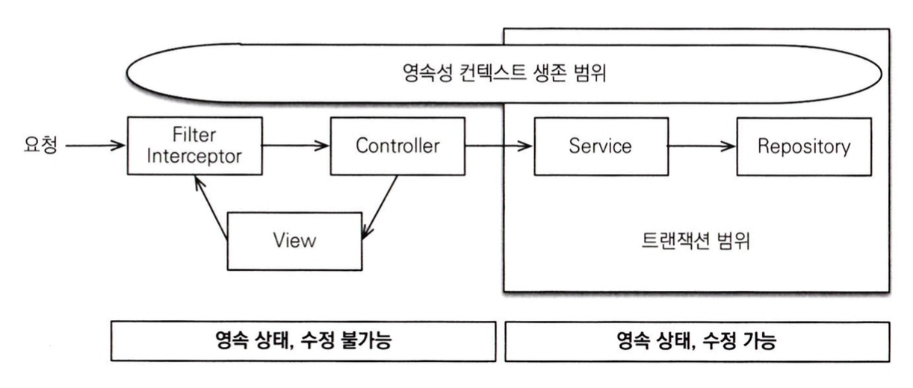

# 트랜잭션 범위의 영속성 컨텍스트

## 스프링 컨테이너의 기본 전략

스프링 컨테이너는 **트랜잭션 범위의 영속성 컨텍스트 전략**을 기본으로 사용한다.  
이는 트랜잭션 범위와 영속성 컨텍스트 생존 범위가 같다.

 

### 트랜잭션 범위의 영속성 컨텍스트 전략

- 트랜잭션이 같으면 같은 영속성 컨텍스트를 사용한다.
  - 다양한 위치에서 엔티티 매니저를 주입받아 사용해도 트랜잭션이 같으면 항상 같은 영속성 컨텍스트를 사용한다.
- 트랜잭션이 다르면 다른 영속성 컨텍스트를 사용한다.
  - 스프링 컨테이너는 스레드마다 각각 다른 트랜잭션을 할당한다.

 

# 준영속 상태와 지연 로딩

트랜잭션은 보통 서비스 계층에서 시작하므로 service, repository 계층에서는 영속 상태가 유지되고, 컨트롤러나 뷰에서는 준영속 상태가 된다.
따라서 변경 감지는 서비스 계층까지만 동작하고 프리젠테이션 계층에서는 동작하지 않는다.  
또한 준영속 상태에서는 지연 로딩 기능도 동작하지 않아서 뷰에 필요한 엔티티들을 영속성 컨텍스트가 살아있을때 로딩해두고 반환해야 한다.

 

# 스프링 OSIV (Open Session In View)

OSIV의 핵심은 뷰에서도 지연 로딩이 가능하도록 하는 것이다

스프링은 다양한 OSIV 클래스들을 제공하고, 용도에 따라 적절한 것을 택해 사용하면 된다.  
스프링이 제공하는 OSIV는 **비즈니스 계층에서 트랜잭션을 사용하는 OSIV**다

- hibernate OSIV servlet filter
- hibernate OSIV spring interceptor
- JPA OEIV servlet filter
- JPA OEIV spring interceptor

 

스프링이 제공하는 OSIV는 다음과 같은 특징이 있다.

- 영속성 컨텍스트를 프리젠테이션 계층까지 유지.
- 프리젠테이션 계층에는 트랜잭션이 없으므로 엔티티 수정 불가능.
- 트랜잭션 없이 읽기를 사용해서 지연 로딩 가능.

