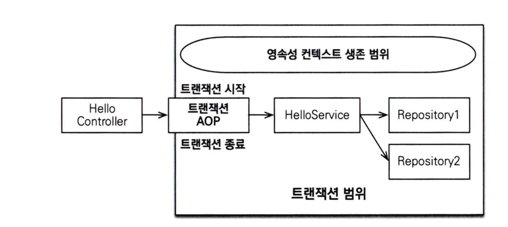

# 트랜잭션 범위의 영속성 컨텍스트

## 스프링 컨테이너의 기본 전략

스프링 컨테이너는 **트랜잭션 범위의 영속성 컨텍스트 전략**을 기본으로 사용한다.  
이는 트랜잭션 범위와 영속성 컨텍스트 생존 범위가 같다.

 

### 트랜잭션 범위의 영속성 컨텍스트 전략

- 트랜잭션이 같으면 같은 영속성 컨텍스트를 사용한다.
  - 다양한 위치에서 엔티티 매니저를 주입받아 사용해도 트랜잭션이 같으면 항상 같은 영속성 컨텍스트를 사용한다.
- 트랜잭션이 다르면 다른 영속성 컨텍스트를 사용한다.
  - 스프링 컨테이너는 스레드마다 각각 다른 트랜잭션을 할당한다.

