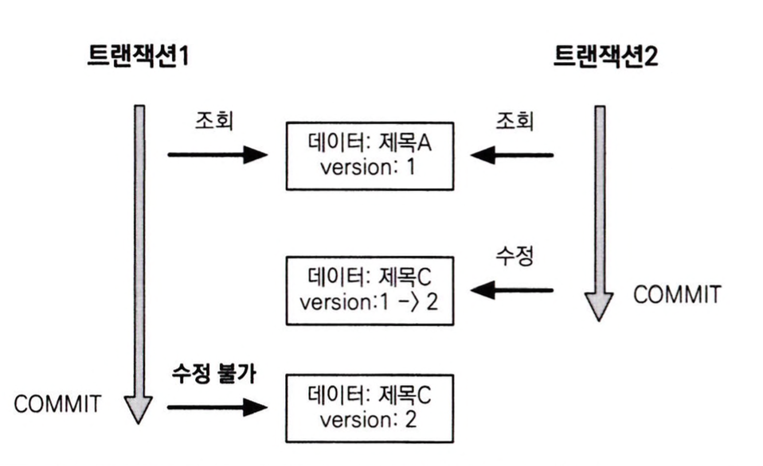
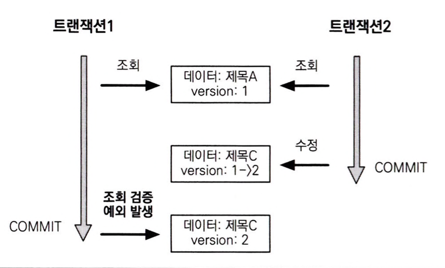
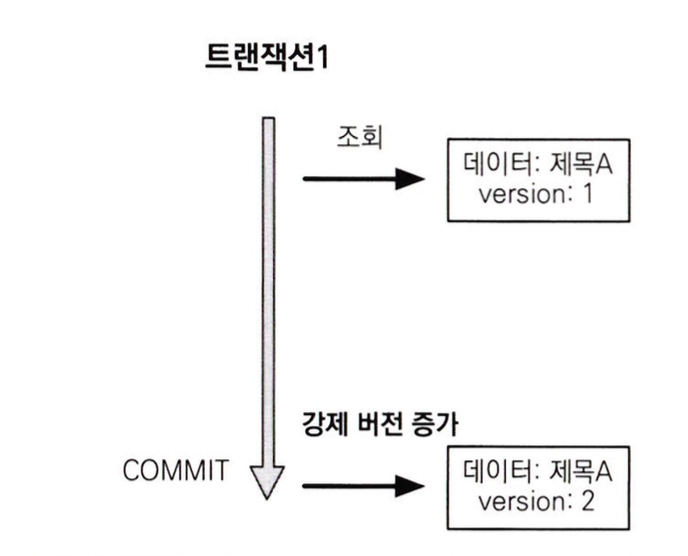
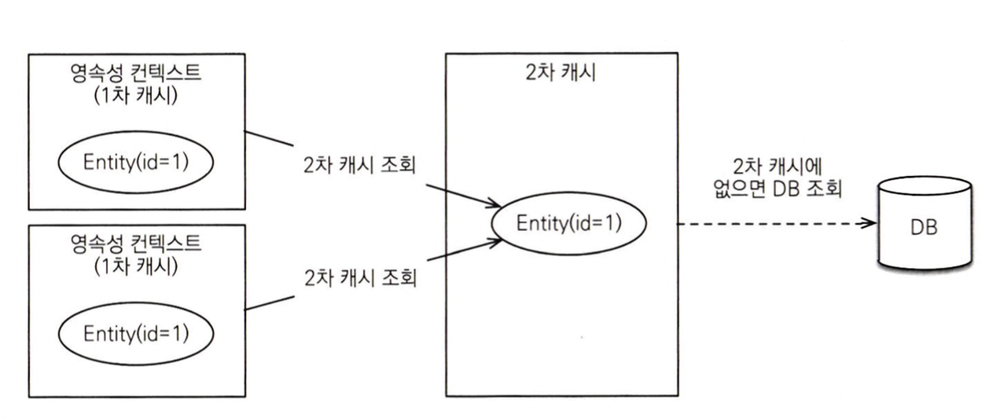
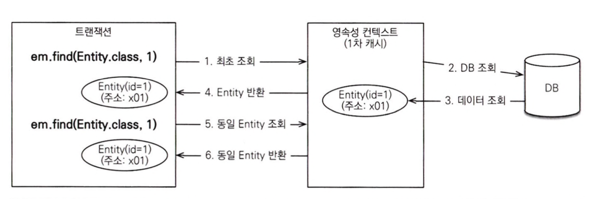
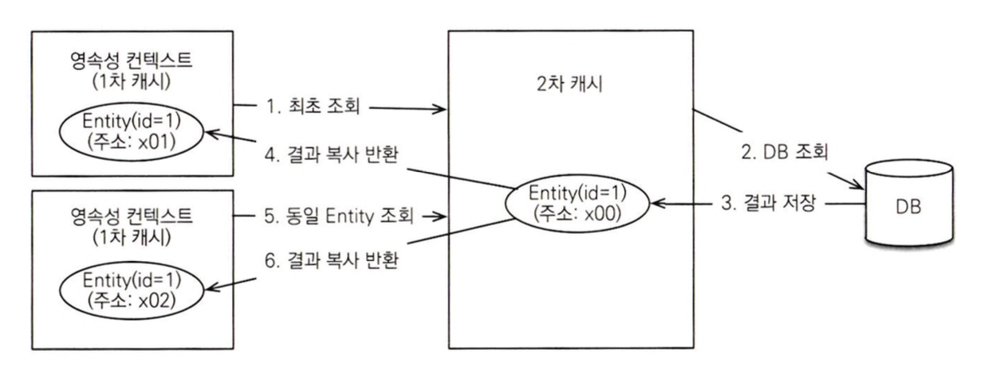

# 트랜잭션과 락

<br>

## 트랜잭션과 격리 수준

트랜잭션은 ACID라고 하는 원자성(Atomicity), 일관성(Consistency), 격리성(Isolation), 지속성(Durability)을 보장해야 한다.

- 원자성 : 트랜잭션 내에서 실행한 작업들은 모두 성공하거나 모두 실패해야 한다.
- 일관성 : 모든 트랜잭션은 일관성있는 데이터베이스 상태를 유지해야 한다.
- 격리성 : 동시에 실행되는 트랜잭션들이 서로에게 영향을 미치지 못하도록 격리한다.
- 지속성 : 트랜잭션이 성공적으로 끝나면 그 결과가 항상 기록되어야 한다.

<br>

트랜잭션의 격리 수준은 4단계로 나누어진다. <br>
격리 수준이 낮을수록 동시성은 증가하지만 다양한 문제가 발생할 수 있다.

- READ UNCOMMITED
- READ COMMITED
- REPEATABLE READ
- SERIALIZABLE

|격리 수준|DIRTY READ|NON-REPEATABLE READ|PHANTOM READ|
|---|---|---|---|
|READ UNCOMMITED|O|O|O|
|READ COMMITED||O|O|
|REPEATABLE READ|||O|
|SERIALIZABLE||||

<br>

### READ UNCOMMITED

커밋하지 않은 데이터를 읽을 수 있다.

T1이 데이터를 수정하고 있을 때 T2가 수정 중인 데이터를 읽을 수 있다. (DIRTY READ) <br>
만약 T2가 DIRTY READ한 데이터를 사용하는데 T1이 롤백을 한다면 데이터 정합성에 문제가 발생할 수 있다.

### READ COMMITED

커밋한 데이터만 읽을 수 있다.

T1이 회원 A를 조회 중인데, T2가 회원 A를 수정하고 커밋한다면 T1이 다시 회원 A를 조회했을 때 수정된 데이터가 조회된다. (NON-REPEATABLE READ) <br>
이처럼 반복해서 같은 데이터를 읽을 수 없는 상태를 NON-REPEATABLE READ라고 한다.

### REPEATABLE READ

한 번 조회한 데이터를 반복해서 조회해도 같은 데이터가 조회된다.

T1이 10살 이하의 회원을 조회했는데, T2가 5살 회원을 추가하고 커밋하면 T1이 다시 조회했을 때 회원 하나가 추가된 상태로 조회된다. (PHANTOM READ) <br>
이처럼 반복 조회 시 결과 집합이 달리지는 것을 PHANTOM READ라고 한다.

### SERIALIZABLE

가장 엄격한 트랜잭션 격리 수준이다. <br>
PHANTOM READ가 발생하지 않지만, 동시성 처리 성능이 급격히 떨어질 수 있다.

<br>

## 낙관적 락과 비관적 락

만약 일부 로직에서만 더 높은 격리 수준을 적용한다면, **낙관적 락**과 **비관적 락**을 사용하면 된다.

**낙관적 락**은 트랜잭션 대부분이 충돌하지 않는다고 가정하는 방법이다. <br>
DB가 사용하는 락 기능을 사용하는 것이 아니라 JPA가 제공하는 버전 관리 기능을 사용한다. <br>
*낙관적 락은 트랜잭션을 커밋하기 전까지는 트랜잭션의 충돌을 알 수 없다.*

**비관적 락**은 트랜잭션의 충돌이 발생한다고 가정하고 우선 락을 건다. <br>
DB가 제공하는 락을 사용하고, 대표적으로 select for update가 있다.

<br>

## @Version

JPA가 제공하는 낙관적 락을 사용하려면 @Version 어노테이션을 사용하여 버전 관리 기능을 추가해야 한다. <br>
@Version 적용 가능 타입은 다음과 같다.

- Long
- Integer
- Short
- Timestamp

```java
@Entity
public class Board {
    @Id
    private String id; 

    private String title;

    @Version
    private Integer version;
}
```

버전 관리 기능을 적용하려면 엔티티에 버전 관리용 필드를 추가하고 @Version을 붙여주면 된다.
이를 적용하면 엔티티를 수정할 때 마다 버전이 하나씩 자동으로 증가하고, 수정할 때 조회 시점의 버전과 수정 시점의 버전이 다르면 예외가 발생한다.



<br>

> 벌크 연산은 버전을 무시한다. 벌크 연산에서 버전을 증가시키려면 버전 필드를 강제로 증가시켜야 한다.


<br>

## JPA 낙관적 락

JPA가 제공하는 낙관적 락은 @Version을 사용한다.

다음은 낙관적 락의 옵션에 따른 효과이다.

### NONE

락 옵션을 적용하지 않아도 엔티티에 @Version이 붙은 필드만 있으면 낙관적 락이 적용된다.

- 용도 : 조회한 엔티티를 수정할 때 다른 트랜잭션에 의해 변경(삭제)되지 않아야 한다. 조회 시점부터 수정 시점까지 보장한다.
- 동작 : 엔티티를 수정할 때 버전을 체크하면서 버전을 증가한다. (DB의 버전 값이 현재 버전이 아니면 예외 발생)
- 이점 : second lost updates problem를 예방한다.

### OPTIMISTIC

@Version만 적용했을땐 엔티티를 수정해야만 버전을 체크하지만, 이 옵션은 조회만 해도 버전을 체크한다. <br>
한 번 조회한 엔티티는 트랜잭션을 종료할 때까지 다른 트랜잭션에서 변경하지 않음을 보장한다.

- 용도 : 조회한 엔티티는 트랜잭션이 끝날 때까지 다른 트랜잭션에 의해 변경되지 않는다.
- 동작 : 트랜잭션을 커밋할 때 버전을 조회해서 현재 엔티티와 같은지 검증한다. (같지 않으면 예외 발생)
- 이점 : DIRTY READ와 NON-REPEATABLE READ를 방지



### OPTIMISTIC_FORCE_INCREMENT

낙관적 락을 사용하면서 버전 정보를 강제로 증가시킨다.

- 용도 : 논리적인 단위의 엔티티 묶음을 관리할 수 있다. (ex. 게시물과 첨부파일이 양방향 관계이다. 게시물을 수정하는데 단순히 첨부파일만 추가하면 게시물의 버전은 증가하지 않는다. 해당 게시물은 물리적으로는 변경되지 않았지만 논리적으로는 변경되었다. 이때 게시물의 버전도 강제로 증가하려면 OPTIMISTIC_FORCE_INCREMENT를 사용하면 된다.)
- 동작 : 엔티티를 수정하지 않아도 트랜잭션을 커밋할때 버전 정보를 강제로 증가시킨다.  (DB의 버전 값이 현재 버전이 아니면 예외 발생)
- 이점 : 강제로 버전을 증가해서 논리적인 단위의 엔티티 묶음을 버전 관리할 수 있다.



<br>

## JPA 비관적 락

JPA 비관적 락은 DB 트랜잭션 락 매커니즘에 의존하는 방법이다. <br>
주로 select for update 구문을 사용하며 시작하고 버전 정보는 사용하지 않는다.

비관적 락은 데이터를 수정하는 즉시 트랜잭션 충돌을 감지할 수 있다.

### PESSIMISTIC_WRITE

DB에 쓰기 락을 걸 때 사용한다.

- 용도 : DB에 쓰기 락을 건다.
- 동작 : select for update를 사용해 락을 건다.
- 이점 : NON-REPEATABLE READ를 방지한다. 락이 걸린 로우는 다른 트랜잭션이 수정할 수 없다.

### PESSIMISTIC_READ

데이터를 읽기만 하고 수정하지 않을 때 사용한다. <br>
DB 대부분은 방언에 의해 PESSIMISTIC_WRITE로 동작한다.

### PESSIMISTIC_FORCE_INCREMENT

비관적 락중 유일하게 버전 정보를 사용한다. (버전 정보를 강제로 증가) <br>
하이버네이트는 nowait을 지원하는 DB에 대해 for update nowait를 적용한다. (nowait를 지원하지 않으면 for update 사용)

<br>
<hr>

# 2차 캐시

## 1차 캐시와 2차 캐시

영속성 컨텍스트 내부에는 엔티티를 보관하는 저장소가 있는데 이것을 1차 캐시라 한다. <br>
일반적인 웹 애플리케이션 환경에서는 트랜잭션을 시작하고 종료할 때까지만 1차 캐시가 유효하다. OSIV를 사용해도 클라이언트의 요청이 들어올 때부터 끝날 때까지만 유효하다. <br>
따라서 애플리케이션 전체로 보면 DB 접근 횟수를 획기적으로 줄이진 못한다.

하이버네이트는 애플리케이션 범위의 캐시를 지원하는데 이를 **공유 캐시**, **2차 캐시**라고 한다.



<br>

### 1차 캐시

1차 캐시는 영속성 컨텍스트 내부에 있다. 엔티티 매니저로 조회하거나 변경하는 모든 엔티티는 1차 캐시에 저장된다. <br>
트랜잭션을 커밋하거나 플러시를 호출하면 1차 캐시에 있는 엔티티의 변경 내역을 DB에 동기화한다.




- 1차 캐시는 같은 엔티티가 있으면 해당 엔티티를 그대로 반환한다. (객체 동일성 보장)
- 1차 캐시는 영속성 컨텍스트 범위의 캐시다. (컨테이너 환경에서는 트랜잭션 범위, OSIV 적용 시 요청 범위)

<br>

### 2차 캐시

애플리케이션에서 공유하는 캐시를 **공유 캐시** 혹은 **2차 캐시**라고 한다. <br>
이는 애플리케이션 범위의 캐시이고 애플리케이션을 종료할 때까지 캐시가 유지된다.




- 2차 캐시는 동시성 극대화를 위해 캐시한 객체를 직접 반환하지 않고 복사본을 만들어서 반환한다.
- 2차 캐시는 DB 기본 키를 기준으로 캐시하지만, 영속성 컨텍스트가 다르면 객체 동일성을 보장하지 않는다.


