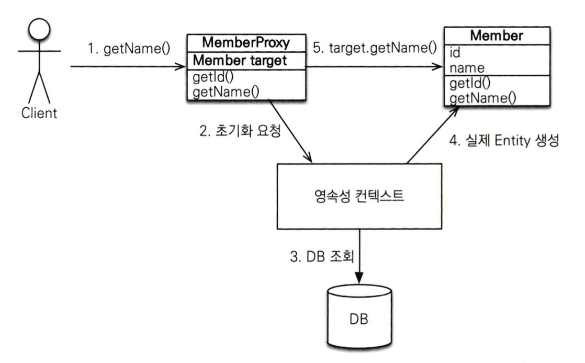
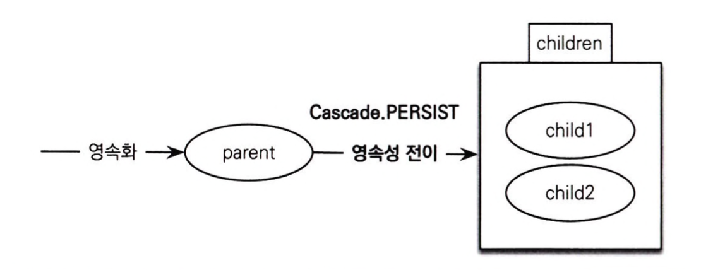

# 프록시

**JPA는 엔티티가 실제 사용될 때까지 DB 조회를 지연하는 지연 로딩을 사용한다.**

지연 로딩 기능을 사용하려면 실제 엔티티 객체 대신 DB 조회를 지연할 수 있는 가짜 객체가 필요한데, 이를 프록시 객체라고 한다.

<br>

## 프록시 기초

엔티티를 실제 사용하는 시점까지 DB 조회를 미루고 싶으면 em.getReference() 메서드를 사용하면 된다. <br>
이 메서드를 호출할 땐 DB를 조회하지 않고, DB 접근을 위임한 프록시 객체를 반환한다.

### 프록시의 특징

- 프록시 클래스는 실제 클래스를 상속 받아서 만들어진다.
- 프록시 객체는 실제 객체에 대한 참조를 보관하고, 프록시 객체의 메서드를 호출하면 프록시 객체는 실제 객체의 메서드를 호출한다.
- 프록시 객체는 처음 한 번만 초기화된다.
- 프록시 객체가 초기화되어도 프록시 객체가 실제 엔티티로 바뀌는 것이 아니고, 프록시 객체를 통해서 실제 엔티티에 접근한다.
- 영속성 컨텍스트에 엔티티가 존재하면, em.getReference()를 호출해도 실제 엔티티가 반환된다.
- 초기화는 영속성 컨텍스트의 도움을 받아야 하므로, 준영속 상태의 프록시를 초기화하면 예외가 발생한다.

### 프록시 객체의 초기화

프록시 객체는 member.getName()처럼 실제 사용될 때 DB를 조회해 실제 엔티티 객체를 생성한다.



<br>

## 프록시와 식별자 

엔티티를 프록시로 조회할 때 식별자 값을 파라미터로 전달하는데, 프록시 객체는 이 식별자 값을 보관한다. <br>
그래서 식별자 값을 조회할때는 프록시를 초기화하지 않는다.

<br>
<hr>

# 즉시 로딩과 지연 로딩

## 즉시 로딩

```java
@Entity
public class Member {

    @ManyToOne(fetch = FetchType.EAGER)
    @JoinColumn(name = ”TEAM_ID”, nullable = false)
    private Team team;

}
```

엔티티를 조회할 때 연관된 엔티티도 함께 조회한다. <br>
대부분의 JPA 구현체는 즉시 로딩을 최적화하기 위해 조인 쿼리를 사용한다.

jpa는 null 제약 조건에 따라 inner join과 left outer join을 다르게 사용한다. <br>
null값이 허용되어 있을 경우, 팀에 소속되지 않은 회원이 있을 가능성이 있기 때문이다.

- @JoinColumn(nullable = true): left outer join 사용
- @JoinColumn(nullable = false): inner join 사용

혹은 @ManyToOne(fetch = FetchType.EAGER, optional = false) 처럼 optional = false로 설정해도 inner join을 사용한다.

<br>

## 지연 로딩

```java
@Entity
public class Member {

    @ManyToOne(fetch = FetchType.LAZY)
    @JoinColumn(name = ”TEAM_ID”, nullable = false)
    private Team team;

}
```

지연 로딩은 team 멤버 변수에 프록시 객체를 넣어 반환하고, 실제 데이터가 필요한 순간에 DB를 조회해 프록시 객체를 초기화한다.

<br>

## 컬렉션 래퍼

하이버네이트는 엔티티를 영속 상태로 만들때 엔티티에 컬렉션이 있으면 원본 컬렉션을 하이버네이트가 제공하는 내장 컬렉션으로 변경한다. <br>
컬렉션은 컬렉션 래퍼가 지연 로딩을 처리해주고, 컬렉션에 대한 프록시 역할을 한다.

<br>

## JPA Fetch 전략

- @ManyToOne, @OneToOne: 즉시 로딩
- @OneToMany, @ManyToMany: 지연 로딩

JPA는 연관된 엔티티가 하나면 즉시 로딩, 컬렉션이면 지연 로딩을 사용한다.

<br>
<hr>

# 영속성 전이 (CASCADE)

## 저장

영속성 전이는 특정 엔티티를 영속 상태로 만들 때 연관된 엔티티도 영속 상태로 만들고 싶을 때 사용한다.

```java
@Entity
public class Parent {
    @OneToMany(mappedBy = "parent", cascade = CascadeType.PERSIST)
    private List<Child> children = new ArrayList<Child>();
    
}
```

cascade = CascadeType.PERSIST 옵션을 적용하면 부모와 자식 엔티티를 한번에 영속화할 수 있다. <br>




## 삭제

cascade = CascadeType.REMOVE를 적용하고 부모 엔티티를 삭제하면 연관된 자식 엔티티도 함께 삭제된다.

<br>
<hr>

# 고아 객체

JPA는 부모 엔티티와 연관관계가 끊어진 자식 엔티티를 자동으로 삭제하는 기능을 제공한다.

```java
@Entity
public class Parent {

    @OneToMany(mappedBy = "parent", orphanRemoval = true)
    private List<Child> children = new ArrayList<Child>();
}
```

<br>

orphanRemoval = true를 적용하고 컬렉션에서 엔티티를 제거하면 자동으로 삭제된다.

고아 객체 제거는 참조가 제거된 엔티티는 다른 곳에서 참조하지 않는 고아 객체로 보고 삭제하는 기능이다. <br>
그래서 이 기능은 참조하는 곳이 하나일 때만 사용해야 하므로, @OneToOne, @OneToMany에서만 사용 가능하다.


