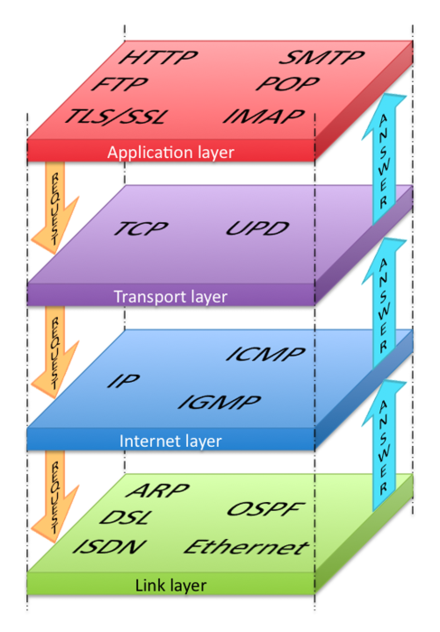

# 프로토콜
- 네트워크에서 통신할때의 규약을 프로토콜이라 한다

<br>

### 물리적 측면 : 데이터 전송 매체, 신호 규약, 회선 규격 등 이더넷이 널리 쓰인다
### 논리적 측면 : 장치들끼리 통신하기 위한 프로토콜 규격. TCP/IP가 널리 쓰인다

<br>

### HTTP 프로토콜의 헤더 (비트로 메시지를 전달하지 않고 문자 자체를 이용해 데이터르 표헌하고 전송)
```
GET / HTTP/1.1
Cookie: _ga=GA1.2.1593064437.1657629348; wcs_bt=s_594799d32448:1660134685;
Accept: text/html,application/xhtml+xml,application/xml;q=0.9,*/*;q=0.8
Host: test.com
User-Agent: Mozilla/5.0 (Macintosh; Intel Mac OS X 10_15_7) AppleWebKit/605.1.15 (KHTML, like Gecko) Version/15.4 Safari/605.1.15
Accept-Language: ko-KR,ko;q=0.9
Accept-Encoding: gzip, deflate, br
Connection: keep-alive
```
- 실제 텍스트 파일과 같은 데이터가 전달되기 때문에 효율성은 비트 기반 프로토콜보다 떨어지지만 다양한 확장이 가능

<br>

### TCP와 IP는 별도 계층에서 동작하는 프로토콜이지만 함께 사용하고 있는데, 이런 프로토콜 묶음을 프로토콜 스택이라 부른다. (프로토콜 스택에는 UDP, ICMP, ARP, HTTP, SMTP, FTP와 같은 다양한 애플리케이션 레이어 프로토콜들이 있다)

<br>

### TCP/IP 프로토콜 스택은 총 4개 부분으로 나뉜다
- 물리 부분인 이더넷 외에 데이터가 목적지를 찾아가게 해주는 네트워크 계층
- 잘린 패킷을 데이터 형태로 잘 조합하도록 도와주는 전송 계층과 애플리케이션 계층




