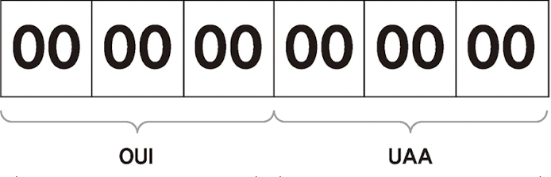

# 네트워크에서 출발지에서 목적지로 데이터를 전송할 때 사용하는 통신 방식

### [유니캐스트] : 출발지와 목적지가 1:1로 통신
- 실제 사용하는 대부분의 통신은 유니캐스트 방식

### [브로드캐스트] : 동일 네트워크에 존재하는 모든 호스트가 목적지
- 유니캐스트로 통신하기 전, 주로 상대방의 정확한 위치를 알기 위해 사용

### [멀티캐스트] : 하나의 출발지에서 다수의 특정 목적지로 데이터 전송
- iptv와 같은 실시간 방송을 볼 때 사용


### [애니캐스트] : 다수의 동일 그룹 중 가장 가까운 호스트에서 응답
- 가장 가까운 DNS 서버를 찾을 때 사용

<br>

# MAC 주소
``` text
2 계층에서 통신을 위해 네트워크 인터페이스에 할당된 고유 식별자
네트워크에 접속하는 모든 장비는 MAC 주소가 있어야 하고 이 주소를 이용해 서로 통신한다
```

### MAC 주소 체계
``` text
MAC 주소는 변경할 수 없도록 하드웨어에 고정되어 출하되므로 네트워크 구성 요소마다 다른 주소를 가지고 있다
48비트의 16진수 12자리로 표현되고 앞의 24비트는 'OUI', 뒤의 24비트는 'UAA'라고 부른다
```


### MAC 주소 동작
``` text
NIC는 자신의 MAC 주소를 가지고 있고 전기 신호가 들어오면 2계층에서 데이터 형태로 변환하여 도착지 MAC 주소를 확인한다 (도착지 주소가 다르면 폐기)
```

<br>

# IP 주소
``` text
3계층에서 사용하는 논리 주소
```

### IP 주소 체계
``` text
192 . 168 . 0 . 1

우리가 흔히 사용하는 IP 주소는 32비트인 IPv4이다. IP는 v4, v6 두 체계가 사용되며 IPv6 주소는 128비트이다
IPv4는 옥텟이라고 부르는 8비트 단위로 나누고 각 옥텟은 "."으로 구분된다

IP 주소도 네트워크 주소, 호스트 주소 두 부분으로 나뉘지만 MAC 주소와 달리 이 둘을 구분하는 경계점이 고정되어 있지 않다
```

<br>

# TCP/UDP

### 4계층 프로토콜(TCP/UDP)과 서비스 포트
``` text
4계층에서 동작하는 프로토콜
목적지 단말 안에서 동작하는 여러 애플리케이션 프로세스 중 통신해야 할 목적지 프로세스를 정확히 찾아가고 패킷 순서가
바뀌지 않도록 잘 조합해 원래 데이터를 잘 만들어내기 위한 역할

패킷을 잘 분할하고 조립하기 위해서 시퀀스 번호와 ACK 번호를 사용한다

4계층의 상위 프로토콜 지시자는 포트 번호이다
포트 번호는 출발지와 목적지를 구분해 처리해야 한다
이 포트 번호 중 HTTP TCP 80, HTTPS TCP 443, SMTP TCP 25같이 잘 알려진 포트번호를 Well Known 포트라고 한다
```

### TCP
``` text
TCP 프로토콜은 신뢰할 수 없는 공용망에서도 정보유실 없는 통신을 보장하기 위해
세션을 안전하게 연결하고 데이터를 분할하고 분할된 패킷이 잘 전송되었는지 확인하는 기능이 있다
패킷에 번호(Sequence Number)를 부여하고 잘 전송되었는지에 대해 응답(Acknowledge Number)한다
또한 한번에 얼마나 보내야 수신자가 잘 받아 처리할 수 있는지 전송 크기까지 고려해 통신한다

패킷에 순서를 부여하는 것을 시퀀스 번호, 응답 번호를 부여하는 것을 ACK 번호라고 부른다
보내는 쪽에서 패킷에 번호를 부여하고 받는 쪽은 이 번호의 순서가 맞는지 확인한다
받은 패킷의 번호가 맞으면 응답을 주는데 이때 다음 번호의 패킷을 요청한다. 이 숫자가 ACK 번호이다
```


``` text
작은 패킷을 하나 보내고 응답을 받아야만 하나를 더 보낼 수 있다면 모든 데이터를 전송하는데 오래 걸릴것이다
그래서 데이터를 보낼때 많은 패킷을 한꺼번에 보내고 응답을 하나만 받는다
최대한 많은 패킷을 한번에 보내는 것이 효율적이지만 네트워크 상태가 안좋으면 패킷 유실 가능성이 커지므로 
적절한 송신량을 결정해야 한다
한 번에 받을 수 있는 데이터 크기를 "윈도 사이즈"라고 하고 네트워크 상황에 따라 이 윈도 사이즈를 조절하는 것을 "슬라이딩 윈도"라고 한다
```

``` text
TCP에서는 안전한 통신을 위해 사전 연결 작업을 한다
3번의 패킷을 주고받으며 통신을 서로 준비하므로 "3방향 핸드셰이크"라고 한다

1. 서버에서는 클라이언트의 접속을 받을 수 있는 'LISTEN' 상태로 대기
2. 클라이언트에서 통신을 시도할 때 Syn 패킷을 보낸다 'SYN-SENT'
3. 클라이언트의 Syn를 받은 서버는 'SYN-RECEIVE' 상태로 변경되고 Syn, Ack로 응답
4. 이 응답을 받은 클라이언트는 'ESTABLISHED' 상태로 변경하고 그에 대한 응답을 서버로 보낸다
5. 서버에서도 클라이언트의 응답을 받오 'ESTABLISHED' 상태로 변경
```

``` text
어떤 패킷이 새로운 연결 시도이고 기존 통신에 대한 응답인지 구분하기 위해 헤더에 플래그라는 값을 넣는다
TCP 플래그는 6가지가 있다

- SYN
  연결 시작 용도로 사용

- ACK
  ACK 번호가 유효할 경우 1로 표시해 보낸다
 
- FIN
  연결 종료시 1로 표시. 데이터 전송을 마친 후 정상적으로 양방향 종료 시 사용
  
- RST
  연결 종료시 1로 표시. 연결 강제 종료를 위해 사용
  
- URG
  긴급 데이터인 경우 1로 표시해 보낸다
  
- PSH
  서버에서 전송할 데이터가 없거나 데이터를 즉시 전달할 것을 지시할때 사용
```

### UDP
``` text
UDP는 음성 데이터나 실시간 스트리밍과 같은 시간에 민감한 프로토콜이나, 단방향으로 다수의 단말과 통신해
응답을 받기 어려운 환경에서 주로 사용된다

이렇게 데이터를 전송하는데 신뢰성보다 일부 데이터 유실되더라도 시간에 맞추어 전송하는게 중요한 경우에 사용

UDP는 TCP와 달리 3방향 핸드셰이크와 같이 사전에 연결을 확인하는 절차가 없다.
그 대신 첫 데이터는 리소스 확보를 위해 인터럽트를 거는 용도로 사용되고 유실된다
```

<br>

### ARP

```text
데이터 통신을 위해 2계층 물리적 주소인 MAC 주소와 3계층 논리적 IP 주소 두 개가 사용된다
IP 주소 체계는 MAC 주소와 연관성이 없으므로 두 개의 주소를 연계시키기 위해 사용되는 프로토콜이 ARP이다
```

<br>

# 서브넷과 게이트웨이
```text
원격지 네트워크와의 통신에 사용되는 장비를 게이트웨이라고 부르고 3계층 장비(라우터와 L3스위치)가 이 역할을 수행
```

### 서브넷과 게이트웨이의 용도
```text
로컬 네트워크에서는 ARP 브로드캐스트를 이용해 도착지 MAC 주소를 학습할 수 있고 이 MAC 주소를 이용해 직접 통신할 수 있다.
하지만 원격 네트워크 통신을 넘어 전달되지 못하는 특성때문에 네트워크 장비의 도움이 필요하다. 이 장비가 '게이트웨이'이고 
게이트웨이에 대한 정보를 PC나 네트워크 장비에 설정하는 항목이 '기본 게이트웨이'이다

'서브넷 마스크'는 출발지와 목적지가 동일한 LAN 내에서의 통신인지, 서로 다른 네트워크간의 통신인지 확인할 때 사용한다.
```

### 2계층 통신과 3계층 통신
```text
로컬 네트워크에서 직접 통신하는 경우 라우터와 같은 3계층 네트워크의 장비 없이 통신이 가능.
단말간을 연결해주는 네트워크 장비에서 2계층까지만 정보를 확인해 통신하고 ARP 요청을 보낼 때 직접 브로드캐스트를 이용하므로 L2통신이라고 한다.

반면 원격지 네트워크와 통신할 때 라우터같은 3계층 장비가 필요하므로 3계층 정보까지 확인해야한다. 이것을 L3통신이라고 한다.
```


