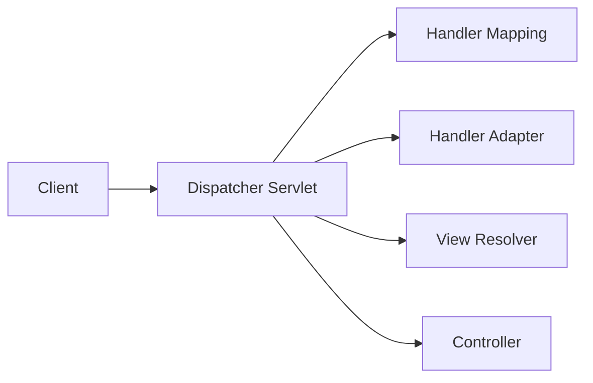

# Dispatcher Servlet 개념

Dispatcher Servlet은 Spring MVC 웹 애플리케이션의 핵심 컴포넌트로 클라이언트의 요청을 받아서 적절한 핸들러로 전달하고, <br>
핸들러의 실행 결과를 받아 응답을 생성한다.

클라이언트의 요청은 URL을 통해 들어오며, Dispatcher Servlet은 이 URL을 기반으로 어떤 핸들러에게 요청을 전달할지 결정한다. <br>
이를 위해 Dispatcher Servlet은 핸들러 매핑, 핸들러 어댑터, 뷰 리졸버 등의 다양한 컴포넌트와 협력한다.

<br>

# Dispatcher Servlet 구조



> 클라이언트가 Dispatcher Servlet에게 요청을 보내고, Dispatcher Servlet은 Handler Mapping을 통해 어떤 핸들러가 해당 요청을 처리할지 찾는다. <br>
> 그 후 Dispatcher Servlet은 Handler Adapter를 통해 찾은 핸들러를 실행하고, 핸들러의 실행 결과를 View Resolver를 통해 적절한 뷰로 변환한다. <br>
> 최종적으로 Dispatcher Servlet은 변환된 뷰를 클라이언트에게 응답으로 보낸다.

<br>

# Dispatcher Servlet 동작 원리

1. 클라이언트가 URL을 통해 요청을 보낸다.
2. 요청은 웹 서버에서 Dispatcher Servlet으로 전달된다.
3. Dispatcher Servlet은 Handler Mapping을 통해 요청을 처리할 핸들러를 찾는다.
4. 찾은 핸들러는 Handler Adapter를 통해 실행되고, 클라이언트의 요청에 따라 필요한 비즈니스 로직을 처리한다.
5. 핸들러의 실행 결과는 ModelAndView 객체에 담겨서 반환된다.
6. Dispatcher Servlet은 View Resolver를 통해 실행 결과를 보여줄 적절한 뷰를 찾는다.
7. 찾은 뷰는 Model 객체와 함께 클라이언트에게 응답으로 보내진다.
8. 클라이언트는 응답을 받고, 필요에 따라 새로운 요청을 보낼 수 있다.


<br>
<hr>


```java
@Controller
public class HelloController {
  
  @RequestMapping("/hello")
  @ResponseBody
  public String hello() {
    return "Hello, Spring!";
  }
}

@Configuration
@EnableWebMvc
public class WebConfig implements WebMvcConfigurer {
  
  @Bean
  public ViewResolver viewResolver() {
    InternalResourceViewResolver resolver = new InternalResourceViewResolver();
    resolver.setPrefix("/WEB-INF/views/");
    resolver.setSuffix(".jsp");
    return resolver;
  }
}

public class AppInitializer implements WebApplicationInitializer {
  
  @Override
  public void onStartup(ServletContext servletContext) throws ServletException {
    AnnotationConfigWebApplicationContext context = new AnnotationConfigWebApplicationContext();
    context.register(WebConfig.class);
    
    DispatcherServlet dispatcherServlet = new DispatcherServlet(context);
    ServletRegistration.Dynamic registration = servletContext.addServlet("dispatcherServlet", dispatcherServlet);
    registration.setLoadOnStartup(1);
    registration.addMapping("/");
  }
}
```

<br>

# Dispatcher Servlet 장점

- **중앙 집중화된 요청 처리**: Dispatcher Servlet은 Spring MVC 웹 애플리케이션에서 클라이언트의 모든 요청을 처리하는 중앙 집중화된 컴포넌트다. 이를 통해 요청 처리 로직을 한 곳에서 관리할 수 있으며, 애플리케이션의 구조와 유지 보수성을 향상시킨다.
- **유연한 핸들러 매핑**: Dispatcher Servlet은 핸들러 매핑을 통해 어떤 핸들러가 요청을 처리할지 결정한다. 핸들러 매핑은 다양한 전략을 사용할 수 있으며, URL 패턴, HTTP 메소드, 요청 헤더 등을 기준으로 핸들러를 선택할 수 있다. 이를 통해 요청의 종류에 따라 다른 핸들러를 지정하거나 동적으로 핸들러를 결정할 수 있다.
- **다양한 핸들러 어댑터 지원**: Dispatcher Servlet은 다양한 핸들러 어댑터를 지원하여 다양한 종류의 핸들러를 처리할 수 있다. 핸들러 어댑터는 특정 핸들러의 실행을 담당하고, 핸들러의 반환 값을 적절한 응답으로 변환한다. 이를 통해 컨트롤러, REST API 핸들러, 비동기 핸들러 등 다양한 핸들러 유형을 처리할 수 있다.
- **유연한 뷰 해결 전략**: Dispatcher Servlet은 View Resolver를 통해 적절한 뷰를 찾고 처리 결과를 뷰에 전달한다. View Resolver는 다양한 뷰 템플릿 엔진과의 통합을 제공하며, 뷰의 위치, 포맷 등을 유연하게 구성할 수 있다. 이를 통해 다양한 형태의 응답을 생성할 수 있다.
- **인터셉터를 통한 전처리 및 후처리**: Dispatcher Servlet은 인터셉터를 통해 요청의 전처리 및 후처리 작업을 수행할 수 있다. 인터셉터는 핸들러 실행 전후에 추가 작업을 수행하며, 인증, 로깅, 트랜잭션 관리 등 다양한 업무 처리를 위해 사용될 수 있다.
- **확장 가능한 구조**: Dispatcher Servlet은 Spring의 웹 애플리케이션 컨텍스트와 긴밀하게 통합되어 있다. 따라서 다른 Spring 기능 및 서비스와의 통합이 용이하며, 커스텀 확장이 가능하다.

