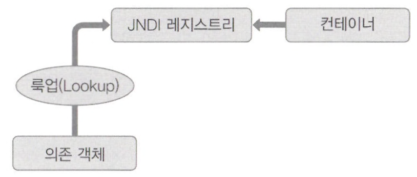
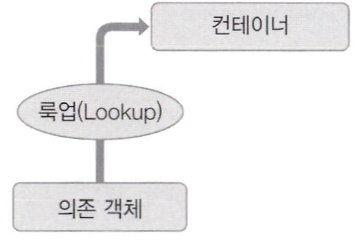

# IoC와 DI

IoC와 DI의 주 목적은 컴포넌트의 의존성을 제공하고, 이러한 의존성을 라이프사이클 전반에 걸쳐 관리하는 편리한 방식을 제공하는 것이다. 

의존성이 필요한 객체를 의존 객체(dependent object)라고 하고 IoC에서는 대상(target)이라고 한다. <br>
일반적으로 IoC는 의존성 주입(DI)과 의존성 룩업(Dependency Lookup, DL) 두 가지로 나뉜다.

<br>

# IoC의 종류

**의존성 룩업** 방식의 IoC에서는 컴포넌트 스스로 의존성의 참조를 가져와야 한다. <br>
반면 **의존성 주입** 방식의 IoC에서는 IoC 컨테이너가 컴포넌트에 의존성을 주입한다.

의존성 룩업은 *의존성 풀, 문맥에 따른 의존성 룩업*이라는 두 가지 방식으로 나뉘고 <br>
의존성 주입은 *생성자 의존성 주입과 수정자 의존성 주입* 두 가지 방식으로 나뉜다.

## 의존성 풀 (dependency pull)

의존성 풀에서는 필요에 따라 레지스트리에서 의존성을 가져오게 된다. <br>
그림은 JNDI 룩업을 통한 의존성 풀 룩업 메커니즘을 사용하는 시나리오이다.



## 문맥에 따른 의존성 룩업 (Contextualized Dependency Lookup, CDL)

CDL은 의존성 풀처럼 특정 중앙 레지스트리에서 의존성을 가져오는 것이 아니라, 자원을 관리하는 컨테이너에서 의존성을 가져온다. <br>
또한 CDL은 늘 수행되는 것이 아니고 몇 가지 정해진 시점에 수행된다.



## 생성자 의존성 주입

생성자 의존성 주입은 컴포넌트의 생성자를 이용해서 해당 컴포넌트가 필요로 하는 의존성을 제공하는 방식이다. <br>
IoC 컨테이너는 해당 컴포넌트를 초기화할 때 컴포넌트에 필요한 의존성을 전달한다.

이 방식에서는 의존성 주입 없이는 빈을 생성할 수 없으므로 반드시 의존성을 주입해야 한다.

```java
public class Constructorinjection { 
  private Dependency dependency;
    
  public Constructorinjection(Dependency dependency) { 
    this.dependency = dependency;
  }
  
}
```

## 수정자(setter) 의존성 주입

수정자 의존성 주입 방식에서 IoC 컨테이너는 자바빈 방식의 수정자 메서드를 이용해 컴포넌트의 의존성을 주입한다. <br>
컴포넌트의 수정자는 IoC 컨테이너가 관리할 수 있도록 의존성을 노출한다.

이 방식은 의존성 없이도 객체를 생성할 수 있으며 해당 수정자를 호출해 의존성을 나중에 제공할 수 있다.

```java
public class Setterinjection { 
  private Dependency dependency;
    
  public void setDependency(Dependency dependency) { 
    this.dependency = dependency;
  }
  
}
```


