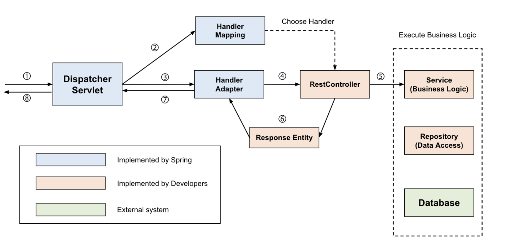

# IoC와 DI

IoC와 DI의 주 목적은 컴포넌트의 의존성을 제공하고, 이러한 의존성을 라이프사이클 전반에 걸쳐 관리하는 편리한 방식을 제공하는 것이다. 

의존성이 필요한 객체를 의존 객체(dependent object)라고 하고 IoC에서는 대상(target)이라고 한다. <br>
일반적으로 IoC는 의존성 주입(DI)과 의존성 룩업(Dependency Lookup, DL) 두 가지로 나뉜다.

<br>
<hr>

# IoC의 종류

**의존성 룩업** 방식의 IoC에서는 컴포넌트 스스로 의존성의 참조를 가져와야 한다. <br>
반면 **의존성 주입** 방식의 IoC에서는 IoC 컨테이너가 컴포넌트에 의존성을 주입한다.

의존성 룩업은 *의존성 풀, 문맥에 따른 의존성 룩업*이라는 두 가지 방식으로 나뉘고 <br>
의존성 주입은 *생성자 의존성 주입과 수정자 의존성 주입* 두 가지 방식으로 나뉜다.

## 의존성 풀 (dependency pull)

의존성 풀에서는 필요에 따라 레지스트리에서 의존성을 가져오게 된다. <br>
그림은 JNDI 룩업을 통한 의존성 풀 룩업 메커니즘을 사용하는 시나리오이다.



## 문맥에 따른 의존성 룩업 (Contextualized Dependency Lookup, CDL)

CDL은 의존성 풀처럼 특정 중앙 레지스트리에서 의존성을 가져오는 것이 아니라, 자원을 관리하는 컨테이너에서 의존성을 가져온다. <br>
또한 CDL은 늘 수행되는 것이 아니고 몇 가지 정해진 시점에 수행된다.


## 생성자 의존성 주입

생성자 의존성 주입은 컴포넌트의 생성자를 이용해서 해당 컴포넌트가 필요로 하는 의존성을 제공하는 방식이다. <br>
IoC 컨테이너는 해당 컴포넌트를 초기화할 때 컴포넌트에 필요한 의존성을 전달한다.

이 방식에서는 의존성 주입 없이는 빈을 생성할 수 없으므로 반드시 의존성을 주입해야 한다.

```java
public class Constructorinjection { 
  private Dependency dependency;
    
  public Constructorinjection(Dependency dependency) { 
    this.dependency = dependency;
  }
  
}
```

## 수정자(setter) 의존성 주입

수정자 의존성 주입 방식에서 IoC 컨테이너는 자바빈 방식의 수정자 메서드를 이용해 컴포넌트의 의존성을 주입한다. <br>
컴포넌트의 수정자는 IoC 컨테이너가 관리할 수 있도록 의존성을 노출한다.

이 방식은 의존성 없이도 객체를 생성할 수 있으며 해당 수정자를 호출해 의존성을 나중에 제공할 수 있다.

```java
public class Setterinjection { 
  private Dependency dependency;
    
  public void setDependency(Dependency dependency) { 
    this.dependency = dependency;
  }
  
}
```

## 의존성 주입 vs 의존성 룩업

EJB 2.1 이하 버전을 사용할 때는 EJB를 JEE 컨테이너에서 가져오려면 의존성 룩업 방식의 IoC를 사용해야 한다. <br>
스프링에서는 초기 빈 룩업을 제외하면 컴포넌트와 의존성은 항상 의존성 주입 방식의 IoC를 이용하여 연결된다.

> 만약 의존성 주입과 의존성 룩업을 선택해야 한다면 정답은 의존성 주입이다. <br>
> 의존성 주입이 컴포넌트에 어떠한 코드 변화도 일으키지 않고, 생성자나 수정자를 이용해 간단히 의존성을 주입할 수 있기 때문이다. <br>
> 또한 의존성 주입을 이용하면 사용자 클래스는 협력 객체를 의존 객체에게 제공하는 IoC 컨테이너와 완전히 분리되어 사용될 수 있지만 <br>
> 룩업을 이용하면 사용자 클래스는 컨테이너에 의해 정의된 클래스와 인터페이스에 항상 의존하게 되고, 테스트하기도 어려워진다.

## 수정자 주입 vs 생성자 주입

**생성자 주입**은 컴포넌트 사용 전에 해당 컴포넌트의 의존성을 반드시 갖고 있어야 할 때 유용하다. <br>
또한 컨테이너가 의존성 점검 메커니즘을 제공하는지와 상관없이 의존성에 대한 요구사항을 지정할 수 있고, 빈 객체를 불변 객체로 사용할 수 있다.

**수정자 주입**의 가장 큰 장점은 주입 메커니즘 중 가장 자유롭게 사용할 수 있다는 것이다. <br>
수정자 주입을 사용하면 새로운 객체를 생성하지 않아도 의존성을 교체할 수 있고, 명시적으로 객체를 주입하지 않더라도 적절한 기본 값을 선택하게 할 수 있다.

<br>
<hr>

# 스프링의 제어 역전 (Inversion of Control, IoC)


스프링은 의존 객체에 협력 객체를 자동으로 제공하기 위해 의존성 주입을 이용한다. <br>
의존성 주입은 협력 객체와 의존 객체를 연결하기 위해 선호하는 메커니즘이지만, 의존 객체에 접근하려면 **의존성 룩업**이 필요하다. <br>
스프링은 다양한 환경에서 의존성 주입만으로 모든 애플리케이션 컴포넌트을 자동으로 연결할 수 없고, <br>
이런 경우 의존성 룩업을 통해 초기 컴포넌트에 접근해야 한다.

> 예를 들어 독립형 자바 애플리케이션에서 스프링을 사용하려면 main() 메서드에서 스프링의 컨테이너를 부트스트랩하고 의존성을 가져와야 한다. <br>
> 하지만 스프링 MVC 기능을 사용해 개발할때는 스프링이 애플리케이션 전체를 자동으로 연결시키므로 의존성 룩업이 필요하지 않다.

<br>
<hr>

# 스프링의 의존성 주입

## 빈과 빈 팩터리

스프링의 의존성 주입 컨테이너의 핵심은 **빈 팩터리 (BeanFactory)** 인터페이스이다.

**BeanFactory**는 컴포넌트의 라이프사이클뿐 아니라 의존성까지 관리한다. <br>
스프링에서 bean이라는 용어는 컨테이너가 관리하는 모든 컴포넌트를 의미한다.

스프링 내부에서 빈 구성은 BeanDefinition 인터페이스를 구현한 클래스의 인스턴스로 표현된다. <br>
빈 구성에는 빈 자체에 대한 정보와 의존하는 빈의 정보가 들어있다. <br>
그러므로 사용자는 BeanFactory내에서 사용자 빈을 식별할 수 있고, 각 빈에 ID나 이름을 지정할 수도 있다.

## 애플리케이션 컨텍스트 (ApplicationContext)

**ApplicationContext** 인터페이스는 BeanFactory를 상속한 인터페이스다. <br>
ApplicationContext는 DI, 트랜잭션, AOP, 애플리케이션 이벤트 처리와 같은 여러 서비스를 제공한다.

<br>
<hr>

# 애플리케이션 컨텍스트 구성하기

## 스프링 구성 옵션 설정하기

원래 스프링은 프로퍼티나 XML 파일을 이용해 빈을 정의할 수 있었다. <br>
스프링 2.5부터는 ApplicationContext를 구성하는데 자바 애너테이션을 지원하기 시작했다.

XML 파일을 사용하면 모든 구성을 자바 코드와 분리해 외부에서 관리할 수 있고, <br>
애너테이션을 사용하면 개발자가 코드 내에서 DI 구성을 정의하고 확인할 수 있다.

XML 구성을 사용하려면 애플리케이션에서 필요한 스프링 네임스페이스 베이스를 선언해야 한다.

```xml
<?xml version="1.0" encoding="UTF-8"?>
<beans xmlns="http://www.springframework.org/schema/beans" 
       xmlns:xsi="http://www.w3.org/2001/XMLSchema-instance" 
       xmlns:c="http://www.springframework.org/schema/c" 
       xsi:schemaLocation="http://www.springframework.org/schema/beans 
                           http://www.springframework.org/schema/beans/sprinq-beans.xsd">
  
</beans>
```

<br>

애플리케이션에서 스프링의 애너테이션을 사용하려면 다음 태그를 XML 구성에 선언해야 한다.

<context:component-scan> 태그는 지정한 패키지의 모든 하위 패키지에 있는 클래스에 선언된 <br>
@Autowired. @Inject. @Resource, @Component, @Controller. @Repository, @Service 애너테이션이 선언된 <br>
의존성 주입이 가능한 빈의 코드를 스캔하도록 스프링에게 지시한다.

```xml
<?xml version="1.0" encoding="UTF-8"?>
<beans xmlns="http://www.springframework.org/schema/beans" 
       xmlns:xsi="http://www.w3.org/2001/XMLSchema-instance" 
       xmlns:context="http://www.springframework.org/schema/context" 
       xmlns:c="http://www.springframework.org/schema/c" 
       xsi:schemaLocation="http://www.springframework.org/schema/beans
            http://www.springframework.org/schema/beans/spring-beans.xsd 
            http://www.springframework.org/schema/context 
            http://www.springframework.org/schema/context/spring-context.xsd">
  
  <context:component-scan base-package="com.apress.prospring5.ch3.annotated"/>
</beans>

```

## 스프링 컴포넌트 선언하기

**어떤 서비스 클래스를 개발하고 스프링에서 사용하기를 원한다면 스프링에게 이 빈이 다른 빈에 주입될 수 있다는 것을 알려주고 스프링이 이 빈을 관리하게 해야한다.**

> 애너테이션을 사용해 빈 정의를 생성하려면 메서드나 생성자에 @Autowired를 적용해서 스프링 IoC 컨테이너가 해당 메서드의 <br>
> 인수 타입에 맞는 빈을 찾아 메서드에 전달하도록 해야 한다.

```java
@Component
public class HelloWorldMessageProvider implements MessageProvider {

    ©Override
    public String getMessage() {
        return "Hello World!"; 
    }
}
```

```java
@Service
public class StandardOutMessageRenderer implements MessageRendere {

    private MessageProvider messageProvider;
    
    @Override
    @Autowired
    public void setMessageProvider(MessageProvider provider) { 
        this.messageProvider = provider;
    }
}
```

### 자바 구성(Java Configuration) 사용하기

애플리케이션에게 필요한 빈 타입이 수정할 수 없는 서드파티 라이브러리의 일부인 경우 @Configuration을 적용한다. <br>
구성 클래스 내에는 스프링 IoC 컨테이너가 빈 인스턴스를 직접 만들 때 직접 호출하는 @Bean 애너테이션이 적용된 메서드가 포함되어 있다. (빈 이름은 메서드와 같다)

```java
@Configuration
public class HelloWorldConfiguration {

    @Bean
    public MessageProvider provider() {
        return new HelloWorldMessageProvider(); 
    }
    
    @Bean
    public MessageRenderer renderer() {
        MessageRenderer renderer = new StandardOutMessageRenderer(); 
        renderer.setMessageProvider(provider());
        return renderer;
    } 
}
```

### 필드 주입 사용하기

필드 주입 방식은 생성자나 수정자를 이용하지 않고 필드에 직접 주입된다. <br>
클래스 멤버 변수에 @Autowired 애너테이션을 적용하면 되고, 개발자가 빈 초기 생성 시 의존성 주입에만 사용되는 코드를 작성하지 않아도 되므로 실용적일 수 있다.

inspirationBean은 private이지만 스프링 컨테이너가 리플렉션을 이용해 필요한 의존성을 주입해주기 때문에 문제없이 주입된다. 

IoC 컨테이너는 Inspiration 타입의 빈을 발견하면 singer 빈의 inspirationBean 멤버에 해당 빈을 주입한다.

```java
@Service("singer") 
public class Singer {

    @Autowired
    private Inspiration inspirationBean; 
    
    public void sing() {
        System.out.println("... " + inspirationBean.getLyric()); 
    }
}

```

<br>

하지만 필드 주입은 여러 단점이 존재한다.

1. 단일 책임 원칙을 위반하지 않도록 주의해야 한다. 의존성이 많아지면 클래스에 대한 책임이 커지므로 리팩토링 시에 관심사를 분리하기 어려울 수 있다.
2. 어떤 타입의 의존성이 필요한지, 의존성이 필수인지 여부가 명확하지 않다.
3. final을 사용할 수 없다.
4. 의존성을 수동으로 주입해야 하므로 테스트 코드 작성이 어렵다.

### 단순 값 주입하기

애너테이션을 이용해 단순 값을 주입하려면, @Value 애너테이션을 빈 프로퍼티에 적용한다.

```java
@Service("injectSimple") 
public class InjectSimple {

    @Value("John Mayer")
    private String name; 
    
    @Value("39")
    private int age; 
    
    @Value("1.92")
    private float height;
    
    public String toString() {
        return "이름 : " + name + "\n"
            + "나이 : " + age + "\n"
            + "키 : " + height;
    }
}
```

<br>
<hr>

# 빈 생성 방식 이해하기


