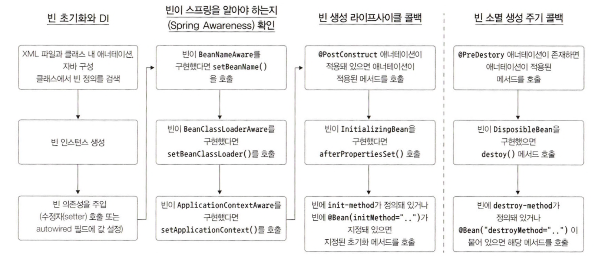

# 빈 라이프사이클 관리

**IoC 컨테이너가 제공하는 기능 중 생성/소멸같은 빈 라이프사이클의 특정 시점에 통지를 받을 수 있게 빈을 생성하는 기능이 있다.**

> 빈이 라이프 사이클이벤트 통지를 받을 수 있게 설정하면 해당 빈은 이벤트 발생 시점에 관련 처리를 할 수 있다.  
> 일반적으로 두 가지 라이프사이클 이벤트가 빈과 관련이 있는데, **초기화 이후**와 **소멸 이전** 이벤트이다.

초기화 이후 이벤트는 빈에 모든 프로퍼티 값을 설정하고 의존성 점검을 마치자마자 발생하고,  
소멸 이전 이벤트는 스프링이 빈 인스턴스를 소멸시키기 전에 발생한다.  
하지만 요청을 받을때마다 빈을 생성하는 프로토타입 빈에는 스프링이 소멸 전 이벤트를 통지하지 않는다.

 

# 빈 생성 시점에 통지 받기

