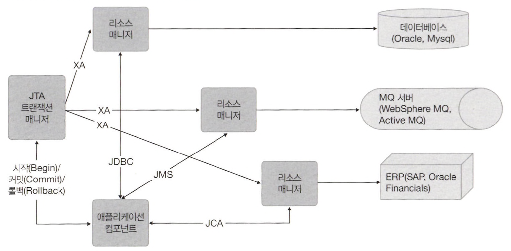
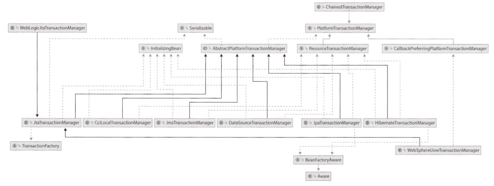

# 스프링 트랜잭션 추상화 레이어

트랜잭션을 사용할 때는 **글로벌 트랜잭션**을 사용할지 **로컬 트랜잭션**을 사용할지 선택해야 한다.

**로컬 트랜잭션**은 단일 트랜잭션 자원(JDBC 연결 등)에 한정되는데,  
**글로벌 트랜잭션**은 컨테이너가 관리하며 여러 트랜잭션 자원에 걸쳐있을 수 있다.

## 트랜잭션 타입

애플리케이션의 모든 처리가 하나의 트랜잭션 자원만 사용해 이루어진다면 로컬 트랜잭션을 사용해도 충분하다.  
하지만 트랜잭션이 다중 트랜잭션 리소스에 걸치도록 확장해야 한다면 글로벌 트랜잭션을 사용해야 한다.

> 자바 세계에서는 JTA로 글로벌 트랜잭션을 구현하고, JTA 호환 트랜잭션 매니저는 각 분산 자원에 설치된 리소스 매니저를 이용해 다중 트랜잭션 리소스에 접근한다.  
> 각 리소스 매니저와 통신은 XA 프로토콜(분산 트랜잭션을 정의하는 개방형 표준)을 사용하고, 2단계 커밋 매커니즘을 사용해 데이터가 모두 업데이트 되거나 모두 롤백되도록 보장한다.

- **리소스 매니저**는 백엔드 리소스에 접근하는데 사용된다. (ex. MySQL 데이터에 접근할 때  MySQL 자바 커넥터가 제공하는 MysqlXADataSource 클래스를 사용해 접근)  
- **JTA 트랜잭션 매니저**는 트랜잭션에 참여하는 모든 리소스 매니저의 트랜잭션 상태를 관리하고, 이때 XA 프로토콜이 사용된다.
- **애플리케이션**은 실행되는 스프링 프레임워크가 트랜잭션을 관리한다. 이때 애플리케이션은 JEE에서 정의한 다양한 표준으로 백엔드 리소스에 접근한다.

 

# PlatformTransactionManager 구현체

스프링에서 PlatformTransactionManager 인터페이스는 TransactionDefinition 인터페이스와 TransactionStatus 인터페이스를 사용해 트랜잭션을 생성하고 관리한다.

 

# 트랜잭션 프로퍼티

트랜잭션은 ACID 프로퍼티(atomicity, consistency, isolation, durability)를 가지고 있고, 트랜잭션 매니저는 이를 기반으로 트랜잭션을 관리할 책임이 있다.  
사용자는 원자성, 일관성, 내구성은 제어할 수 없지만 **트랜잭션 전파와 시간 초과, 읽기 전용 구성, 격리 수준은 제어가 가능하다.**

스프링은 이런 설정을 TransactionDefinition 인터페이스에 캡슐화한다.  
TransactionDefinition는 PlatformTransactionManager에서 사용되며, PlatformTransactionManager의 여러 구현체는 JDBC나 JTA같은 플랫폼에서 트랜잭션 관리를 수행한다.

TransactionStatus 인터페이스는 트랜잭션 결과를 설정하고 트랜잭션의 완료 여부나 새 트랜잭션인지의 여부를 확인하는데 사용된다.

## TransactionDefinition 인터페이스

