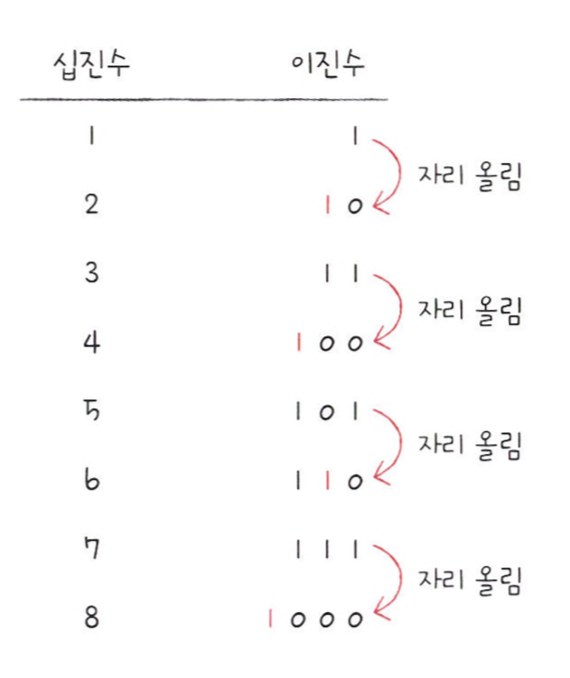

# 0과 1로 숫자를 표현하는 방법

> 컴퓨터는 0과 1로 모든 정보를 표현하고, 0과 1로 표현된 정보만을 이해할 수 있다.

 
 

## 정보 단위

> 0과 1을 나타내는 가장 작은 단위를 '비트'라고 한다.  
> n비트는 2^n가지 정보를 표현할 수 있다.  
> '바이트'는 여덟 개의 비트를 묶은 단위로 비트보다 한 단계 큰 단위.  
> 1바이트는 8비트와 같으니 2^8(256)개의 정보를 표현할 수 있다.

 

<image src="img/1.png" />

 

## 이진법

> 수학에서 0과 1만으로 모든 숫자를 표현하는 방법을 '이진법'이라고 한다.  
> 이진법은 아래와 같이 숫자가 1을 넘어가는 시점에 자리 올림을 하여 0과 1, 두 개의 숫자만으로 모든 수를 표현한다.

 

## 십육진법

> '십육진법'은 수가 15를 넘어가는 시점에서 자리 올림을 하는 숫자 표현 방식이다.
> 그리고 십진수 10, 11, 12, 13, 14, 15를 십육진법에서는 각각 A, B, C, D, E, F로 표기한다.

 

## 문자 집합과 인코딩

