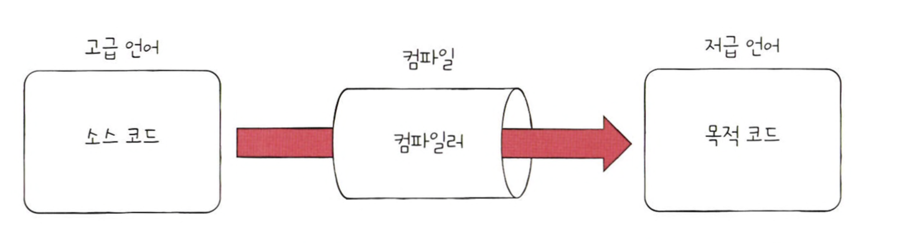

## 고급 언어와 저급 언어

> 컴퓨터는 C, C++, Java, Python과 같은 프로그래밍 언어를 이해하지 못한다.  
> 우리가 프로그램을 만들때 사용하는 프로그래밍 언어는 컴퓨터가 이해하는 언어가 아닌 사람이 이해하고 작성하기 쉽게 만들어진 언어이다.  
> 이렇게 사람을 위한 언어를 '고급 언어'라고 하고 컴퓨터가 직접 이해하고 실행할 수 있는 언어를 '저급 언어'라고 한다.  
> 고급 언어로 작성된 소스 코드가 실행되려면 반드시 저급 언어(명령어)로 변환되어야 한다.  

 

### 저급 언어

> 저급 언어에는 기계어와 어셈블리어가 있다.  
> 우선 기계어란 0과 1의 명령어 비트로 이루어진 언어이다.  
> 기계어는 오로지 컴퓨터를 위해 만들어진 언어이기 때문에 사람이 읽기가 어렵다.  
> 그래서 등장한 저급 언어가 '어셈블리어'

 

### 컴파일 언어와 인터프리터 언어

> 고급 언어가 저급 언어로 변환되는 방식에는 '컴파일'방식과 '인터프리트'방식이 있다.  

 

### 컴파일 언어

> 컴파일 언어는 컴파일러에 의해 소스 코드 전체가 저급 언어로 변환되어 실행되는 고급언어이다.  
> 컴파일 수행을 도와주는 '컴파일러'는 개발자가 작성한 소스 코드 전체를 쭉 훑어보며 소스 코드에 문법적인 오류는 없는지,  
> 실행 가능한 코드인지, 실행하는 데 불필요한 코드는 없는지 등을 따지며 소스 코드를 처음 부터 끝까지 저급 언어로 컴파일한다.  
> 이렇게 컴파일러를 통해 저급 언어로 변환된 코드를 '목적 코드'라고 한다.

 

### 인터프리터 언어

> 인터프리터 언어는 인터프리터에 의해 소스 코드가 한 줄씩 실행되는 고급 언어  
> 인터프리터 언어는 소스 코드를 한 줄씩 실행하기 때문에 소스 코드 전체를 저급 언어로 변환하는 시간을 기다릴 필요가 없다.  
> 소스 코드를 한 줄씩 실행하기 때문에 소스 코드 N번째 줄에 문법 오류가 있더라도 N-1번째 줄까지는 올바르게 수행된다.  
> 소스 코드 마지막까지 한 줄씩 저급 언어로 해석해야 하기 때문에 일반적으로 컴파일 언어보다 느리다.

