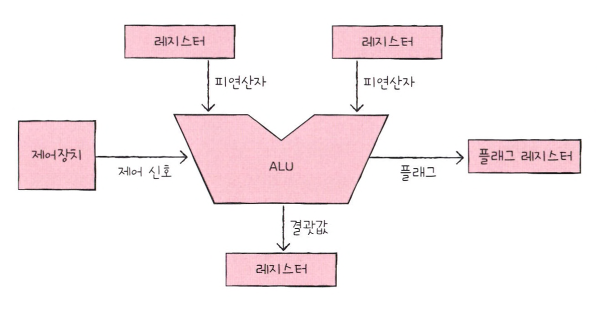
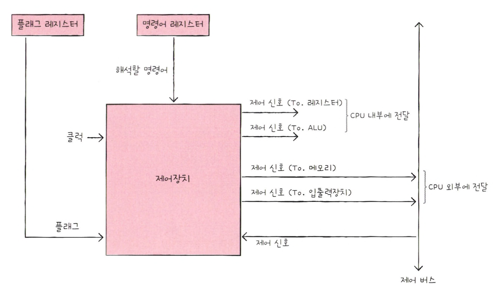

# ALU와 제어장치

> CPU는 메모리에 저장된 명령어를 읽어 들이고, 해석하고, 실행하는 장치이다.  
> CPU 내부에는 계산을 담당하는 ALU, 명령어를 읽어들이고 해석하는 제어장치, 작은 임시 저장 장치인 레지스터라는 구성 요소가 있다.  

 

## ALU

> ALU는 레지스터를 통해 피연산자를 받아들이고, 제어장치로부터 수행할 연산을 알려주는 제어 신호를 받아들인다.  
> ALU는 레지스터와 제어장치로부터 받아들인 피연산자와 제어 신호로 산술 연산, 논리 연산 등 다양한 연산을 수행한다.  
> 연산을 수행한 결과는 숫자나 문자, 메모리 주소가 될 수 있다. 그리고 이 결과값은 바로 메모리에 저장되지 않고 일시적으로 레지스터에 저장된다.  
> CPU가 메모리에 접근하는 속도는 레지스터에 접근하는 속도보다 훨씬 느리기 때문에 결과값을 메모리가 아닌 레지스터에 우선 저장한다.  

> ALU는 계산 결과와 더불어 플래그를 내보낸다.  
> 예를 들어 연산 결과가 음수일 때 ALU는 '방금 계산한 결과가 음수'라는 추가 정보를 내보낸다.  
> 혹은 연산 결과가 연산 결과를 담을 레지스터보다 클 때 ALU는 ‘결괏값이 너무 크다’라는 추가 정보를 내보낸다.  
> 이러한 연산 결과에 대한 추가적인 상태 정보를 '플래그'라고 한다.

 

## 제어장치

 

### 제어장치는 클럭 신호를 받아들인다

> '클럭'이란 컴퓨터의 모든 부품을 일사불란하게 움직일 수 있게 하는 시간 단위이다.  
> 클럭의 주기에 맞춰 한 레지스터에서 다른 레지스터로 데이터가 이동되거나, ALU에서 연산이 수행되거나, CPU가 메모리에 저장된 명령어를 읽어들인다.  

### 제어장치는 해석해야 할 명령어를 받아들인다

> CPU가 해석해야 할 명령어는 '명령어 레지스터'라는 특별한 레지스터에 저장된다.  
> 제어장치는 이 명령어 레지스터로부터 해석할 명령어를 받아들이고 해석한 뒤, 제어신호를 발생시켜 컴퓨터 부품들에 수행해야 할 내용을 알려준다.

### 제어장치는 플래그 레지스터 속 플래그 값을 받아들인다

> 제어장치는 플래그 값을 받아들이고 이를 참고하여 제어 신호를 발생시킨다.

### 제어장치는 시스템 버스, 그 중 제어 버스로 전달된 제어 신호를 받아들인다

> 제어 신호는 CPU뿐만 아니라 입출력장치를 비롯한 CPU 외부 장치도 발생시킬 수 있다.  
> 제어장치는 제어 버스를 통해 외부로부터 전달된 제어 신호를 받아들인다.

 

### 제어장치는 CPU 외부에 제어 신호를 전달한다

> CPU 외부에 제어 신호를 전달한다는 말은, 제어 버스로 제어 신호를 보낸다는 말이다.  
> 이러한 제어 신호에는 크게 메모리에 전달하는 신호와 입출력장치에 전달하는 신호가 있다.  
> 메모리에 저장된 값을 읽거나 메모리에 새로운 값을 쓰고 싶다면 메모리로 제어 신호를 내보낸다.  
> 입출력장치의 값을 읽거나 입출력장치에 새로운 값을 쓰고 싶을 때는 입출력장치로 제어 신호를 내보낸다.

### 제어장치는 CPU 내부에 제어 신호를 전달한다

> CPU 내부에 전달하는 제어 신호에는 크게 ALU에 전달하는 신호와 레지스터에 전달하는 신호가 있다.  
> ALU에는 수행할 연산을 지시하기 위해, 레지스터에는 레지스터 간에 데이터를 이동시키거나 레지서트에 저장된 명령어를 해석하기 위해 신호를 보낸다.

