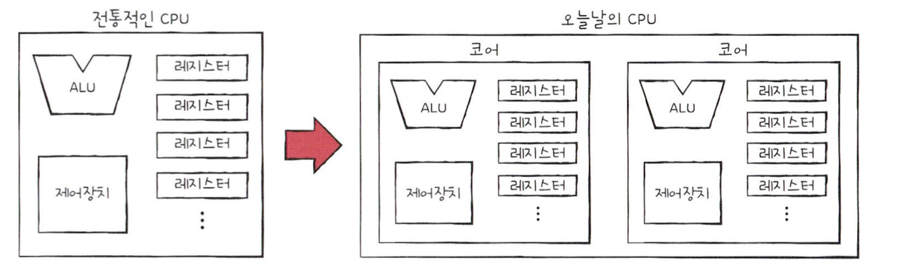
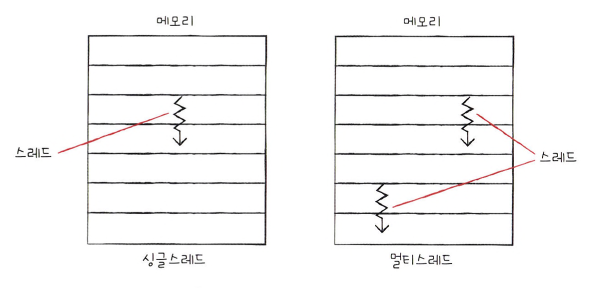
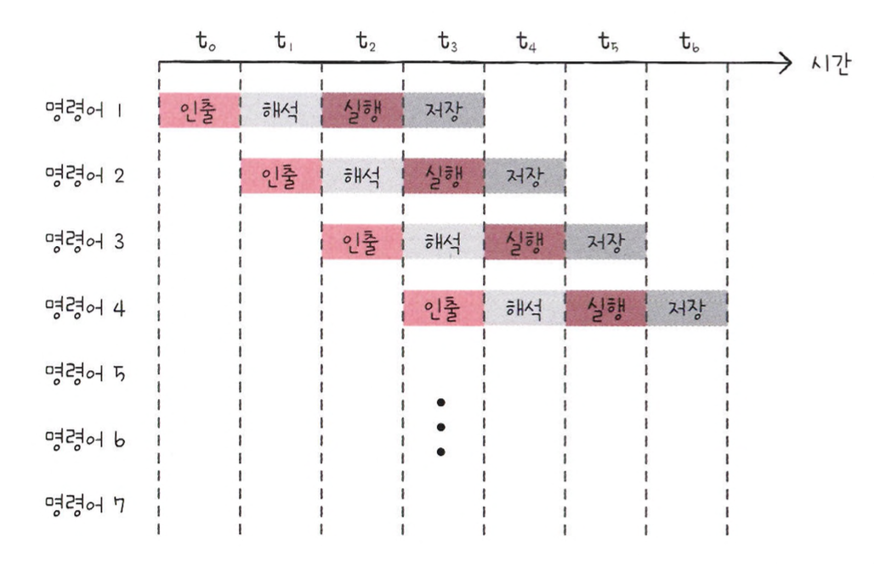
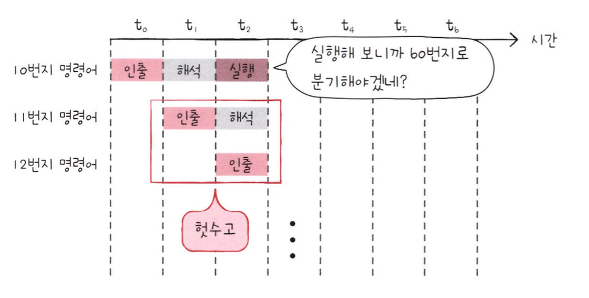

# 빠른 CPU를 위한 설계 기법

## 클럭

- 컴퓨터 부품들은 '클럭 신호'에 맞춰 일사불란하게 움직인다.
- CPU는 '명령어 사이클'이라는 정해진 흐름에 맞춰 명령어들을 실행한다.

> 클럭 신호가 빠르게 반복되면 CPU를 비롯한 컴퓨터 부품들은 그만큼 빠른 박자에 맞춰 움직인다. <br>
> 실제로 클럭 속도가 높은 CPU들은 일반적으로 성능이 좋다


<br>
<hr>


## 코어와 멀티코어

> CPU의 정의로 알고 있던 '명령어를 실행하는 부품'은 오늘날 '코어'라는 용어로 사용된다.
> 8코어는 명령어를 실행하는 부품이 8개 포함되어 있는 것. <br>
> 하지만 CPU의 연산 속도가 꼭 코어 수에 비례해서 증가하지는 않는다. <br>
> 중요한 것은 코어마다 처리할 명령어들을 얼마나 적절하게 분배하느냐 이다. 

<br>




<br>
<hr>


## 스레드와 멀티스레드

> 스레드에는 CPU에서 사용되는 '하드웨어적 스레드'가 있고 <br>
> 프로그램에서 사용되는 '소프트웨어적 스레드'가 있다.

<br>

### 하드웨어적 스레드

> 스레드를 하드웨어적으로 정의하면 '하나의 코어가 동시에 처리하는 명령어 단위' <br>
> 여러 스레드를 지원하는 CPU는 하나의 코어로도 여러 개의 명령어를 동시에 실행할 수 있다. <br>
> 예를 들어 2코어 4스레드 CPU는 명령어를 실행하는 부품이 두개이고, 한 번에 네 개의 명령어를 처리할 수 있다. <br>
> 이처럼 하나의 코어로 여러 명령어를 동시에 처리하는 CPU를 '멀티스레드 프로세서' 혹은 '멀티스레드 CPU'라고 한다.


<br>

### 소프트웨어적 스레드

> 소프트웨어적으로 정의된 스레드는 '하나의 프로그램에서 독립적으로 실행되는 단위'

<br>




<br>
<hr>


## 멀티스레드 프로세서

> 멀티스레드 프로세서를 설계하는데 핵심은 레지스터이다. <br>
> 하나의 코어로 여러 명령어를 동시에 처리하도록 만들려면 프로그램 카운터, 스택 포인터, 데이터 버퍼 레지스터, <br>
> 데이터 주소 레지스터와 같이 하나의 명령어를 처리하기 위해 꼭 필요한 레지스터를 여러 개 가지고 있으면 된다. 


<br>
<br>


# 명령어 병렬 처리 기법

> 빠른 CPU를 만들려면 CPU가 놀지 않고 시간을 효율적으로 쓰며 작동하게 만드는것도 중요하다. <br>
> 명령어를 동시에 처리하며 CPU를 쉬지 않게 하는 기법인 '명령어 병렬 처리 기법'이 있고, <br>
> 이 중에는 '명령어 파이프 라이닝', '슈퍼스칼라', '비순차적 명령어 처리'가 있다.

<br>

## 명령어 파이프라인

명령어 처리 과정을 클럭 단위로 나누어 보면 일반적으로 다음과 같이 나눌 수 있다.
여기서 중요한 점은 같은 단계가 겹치지만 않으면 CPU는 각 단계를 동시에 실행할 수 있다.

- 명령어 인출
- 명령어 해석
- 명령어 실행
- 결과 저장



<br>

<p>파이프라이닝이 높은 성능을 가져오긴 하지만 특정 상황에서는 성능 향상에 실패할 수 있다.</p>

<br>

### 데이터 위험

'데이터 위험'은 명령어 간 데이터 의존성에 의해 발생한다.

```text
명령어 1 : R1 <- R2 + R3    // R2 레지스터 값과 R3 레지스터 값을 더한 값을 R1 레지스터에 저장
명령어 2 : R4 <- R1 + R5    // R1 레지스터 값과 R5 레지스터 값을 더한 값을 R4 레지스터에 저장
```

위의 경우 명령어 1을 수행해야만 명령어 2를 수행할 수 있다. <br>
이처럼 데이터 의존적인 두 명령어를 무작정 동시에 실행하려고 하면 파이프라인이 제대로 작동하지 않는데, 이를 ‘데이터 위험’이라고 한다.

<br>

### 제어 위험

'제어 위험'은 주로 분기 등으로 인한 프로그램 카운터의 갑작스러운 변화에 의해 발생한다. <br>
이를 위해 사용하는 기술 중 하나가 '분기 예측'



<br>

### 구조적 위험

'구조적 위험'은 명령어들을 겹쳐 실행하는 과정에서 서로 다른 명령어가 동시에 ALU, 레지스터 등과 같은 CPU 부품을 사용하려 할 때 발생한다.


<br>
<hr>


## 슈퍼스칼라


