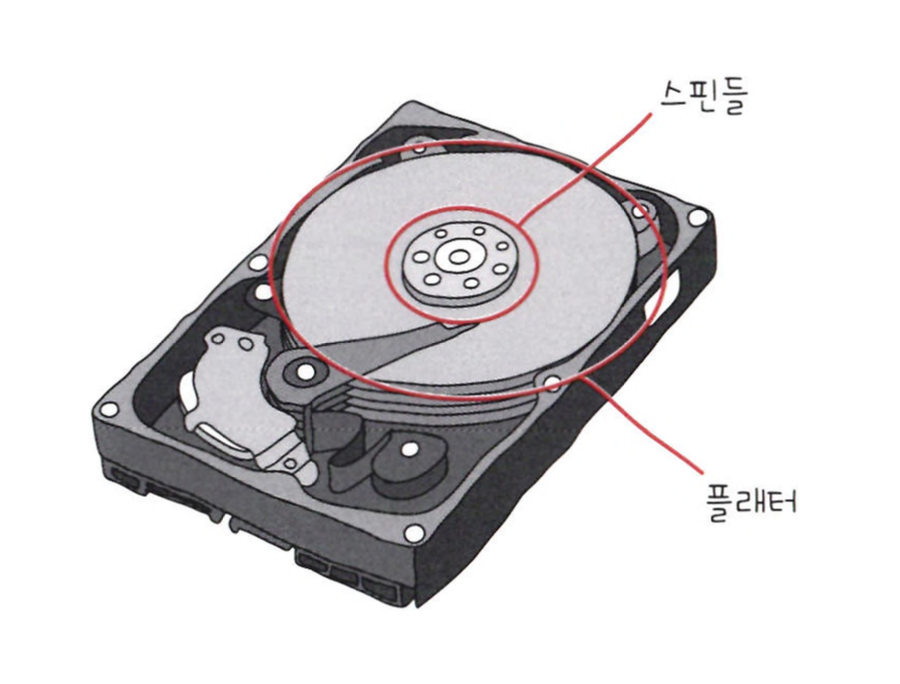
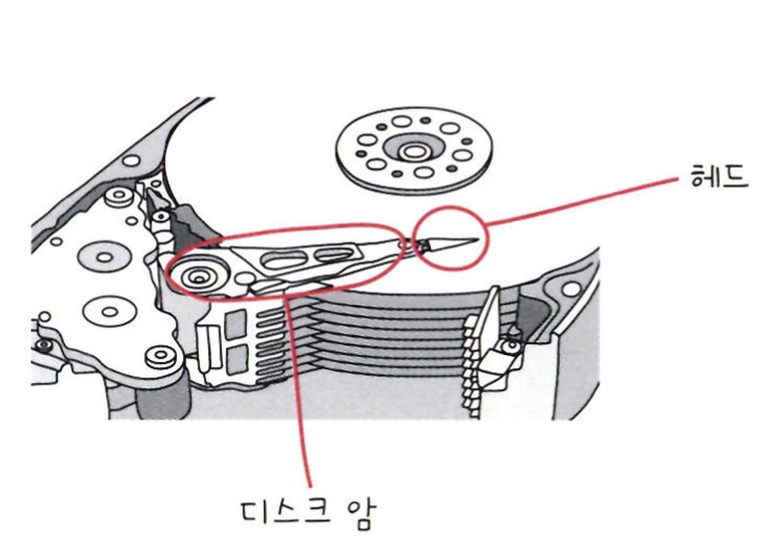
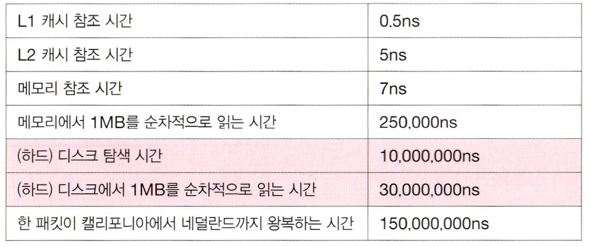

# 다양한 보조기억장치

## 하드 디스크

하드 디스크는 자기적인 방식으로 데이터를 저장하는 보조기억장치이다.

 

하드 디스크에서 데이터가 실질적으로 저장되는 곳을 ***플래터***라고 한다.  
플래터는 자기 물질로 덮여 N극과 S극을 저장하고, 이게 0과 1의 역할을 수행한다.

플래터를 회전시키는 구성 요소를 ***스핀들***이라고 한다.  
스핀들이 플래터를 돌리는 속도는 RPM (Revolution Per Minute) 단위이다.

 

플래터를 대상으로 데이터를 읽고 쓰는 구성 요소는 ***헤드***라고 하고  
헤드는 원하는 위치로 헤드를 이동시키는 ***디스크 암***에 부착되어 있다.

 

하드 디스크에서 다량의 데이터를 탐색하고 읽는 시간은 생각보다 오래 걸린다.

 

## 플래시 메모리

