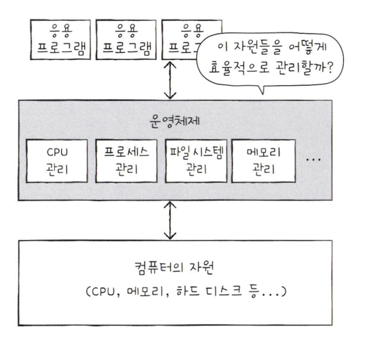

# 운영체제를 알아야 하는 이유

## 운영체제란

모든 프로그램은 실행하기 위해 자원(CPU, 메모리, 보조기억장치 등)이 필요하다.  
실행할 프로그램에 필요한 자원을 할당하고 프로그램이 올바르게 실행되도록 돕는 특별한 프로그램이 **운영체제**이다.

운영체제 또한 여느 프로그램과 마찬가지로 메모리에 적재되어야 한다.  
다만 운영체제는 항상 컴퓨터가 부팅될 때 메모리 내 **커널 영역**이라는 공간에 따로 적재되어 실행된다.  
커널 영역을 제외한 나머지 영역, 사용자가 이용하는 응용 프로그램이 적재되는 영역을 **사용자 영역**이라고 한다.

운영 체제는 실행할 프로그램을 메모리에 적재하고, 실행되지 않는 프로그램을 삭제하며 지속적으로 메모리 자원을 관리한다.

