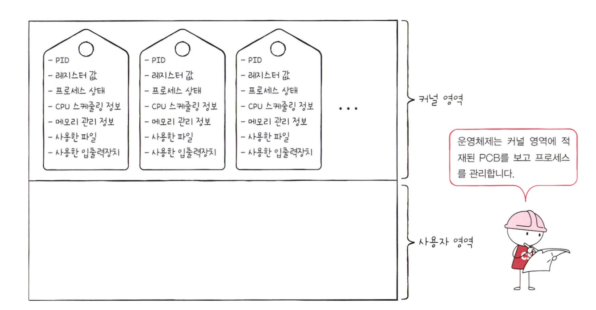

# 프로세스 개요

**프로세스**란 실행중인 프로그램을 의미한다.  
프로그램은 실행되기 전까지는 보조기억장치에 있는 데이터 덩어리일 뿐이지만, 보조기억 장치에 저장된 프로그램을 메모리에 적재하고 실행하는 순간 그 프로그램은 프로세스가 된다.

프로세스 중에는 사용자가 보는 앞에서 실행되는 **포그라운드 프로세스**와  
사용자가 보지 못하는 뒤 편에서 실행되는 **백그라운드 프로세스**가 존재한다.

 

## 프로세스 제어 블록

모든 프로세스는 실행을 위해 CPU가 필요하지만, CPU 자원은 한정되어 있어 모든 프로세스가 동시에 CPU를 사용할 수 없다.  
자신의 차례가 되면 정해진 시간만큼 CPU를 이용하고, 인터럽트(타이머 인터럽트)가 발생하면 자신의 차례를 양보하고 다음 차례가 올 때까지 기다린다.

운영체제는 프로세스의 실행 순서를 관리하고, 프로세스에 자원을 배분하기 위해 프로세스 제어 블록 (PCB : Process Control Block)을 이용한다.  
PCB는 프로세스와 관련된 정보를 저장하는 자료구조이고, 커널 영역에서 생성된다.

### 프로세스 ID (PID)

PID는 특정 프로세스를 식별하기 위해 부여하는 고유한 번호이다.  
같은 일을 수행하는 프로그램이라도 두 번 실행하면 PID가 다른 두 개의 프로세스가 생성된다.

### 레지스터 값

프로세스는 자신의 실행 차례가 돌아오면 이전까지 사용했던 레지스터의 중간값들을 모두 복원한다.  
그래야 이전까지 진행했던 작업들을 실행할 수 있다. (PCB 안에 레지스터 값들이 담긴다)

### 프로세스 상태

현재 프로세스가 어떤 상태인지도 PCB에 기록된다.

### CPU 스케줄링 정보

프로세스가 언제, 어떤 순서로 CPU를 할당받을지에 대한 정보도 PCB에 기록된다.

### 메모리 관리 정보

프로세스마다 메모리에 저장된 위치가 달라서, PCB에는 메모리 주소를 알 수 있는 정보가 담긴다.

### 사용한 파일과 입출력장치 목록

프로세스가 실행 과정에서 특정 입출력장치나 파일을 사용하면 PCB에 해당 내용이 명시된다.

