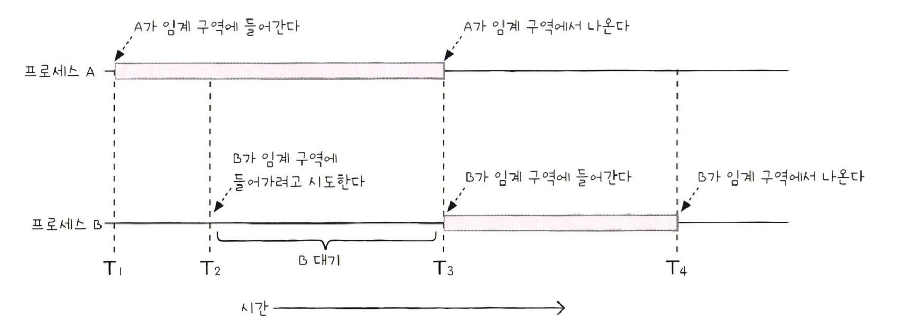

# 동기화란

## 동기화의 의미

동시다발적으로 실행되는 프로세스들은 서로 협력하며 영향을 주고 받기도 한다.  
이렇게 협력하여 실행되는 프로세스들은 실행 순서와 자원의 일관성을 보장해야 하기에 **동기화**되어야 한다.

**프로세스 동기화**란 프로세스들 사이의 수행 시기를 맞추는 것이다.  
프로세스들 사이의 수행 시기를 맞추는 것은 두 가지를 의미한다.

1. 실행 순서 제어 : 프로세스를 올바른 순서대로 실행하기
2. 상호 배제 : 동시에 접근해서는 안 되는 자원에 하나의 프로세스만 접근하게 하기

 

## 공유 자원과 임계 구역

프로세스들이 작업을 할 때 사용하는 공동의 자원을 **공유 자원**이라고 한다.  
**공유 자원**은 전역 변수, 파일, 입출력장치, 보조기억장치같은 것들이 될 수 있다.

**임계 구역**이란 동시에 실행하면 문제가 발생하는 자원에 접근하는 코드 영역을 의미한다.  
두 개 이상의 프로세스가 임계 구역에 진입하고자 하면 둘 중 하나는 대기해야 한다.

 

임계 구역은 두 개 이상의 프로세스가 동시에 실행되면 안되는 영역이지만,  
잘못된 실행으로 인해 여러 프로세스가 동시에 임계 구역의 코드를 실행하여 문제가 발생하는 경우가 있다.  
이를 **레이스 컨디션**이라고 한다.

운영체제는 이러한 임계 구역 문제를 세가지 원칙으로 해결한다.

1. 상호 배제 : 한 프로세스가 임계 구역에 진입했다면 다른 프로세스는 임계 구역에 들어올 수 없다.
2. 진행 : 임계 구역에 어떤 프로세스도 진입하지 않았다면 임계 구역에 진입하고자 하는 프로세스는 들어갈 수 있어야 한다.
3. 유한 대기 : 임계 구역에 들어오기 위해 무한정 대기해서는 안된다.

 

# 동기화 기법

