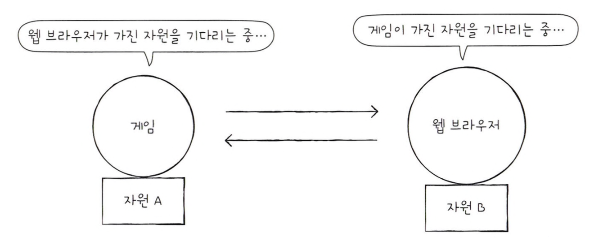

# 교착 상태란

프로세스를 실행하기 위해서는 자원이 필요한데, 두 개 이상의 프로세스가 각자 가지고 있는 자원을  
무작정 기다린다면 프로세스가 더 이상 진행할 수 없는 **교착 상태**가 된다.

 

## 교착 상태 발생 조건

교착 상태가 발생할 조건에는 **상호 배제, 점유와 대기, 비선점, 원형 대기**가 있다.  
이 조건 중 하나라도 만족하지 않는다면 교착 상태가 발생하지 않지만, 모두 만족되면 교착 상태가 발생할 가능성이 생긴다.

### 상호 배제

교착 상태가 발생한 근본적인 원인은 해당 자원을 한 번에 하나의 프로세스만 이용 가능했기 때문이다.  
한 프로세스가 사용하는 자원을 다른 프로세스가 사용할 수 없는 상황에서(**상호 배제**) 교착 상태가 발생할 수 있다.

### 점유와 대기

어떤 자원을 할당받은 상태에서 다른 자원을 할당받기를 기다리는 상태를 **점유와 대기**라고 한다.

### 비선점

비선점 자원은 그 자원을 이용하는 프로세스의 작업이 끝나야만 이용할 수 있다.  
어떤 프로세스도 다른 프로세스의 자원을 강제로 뺏지 못했기 때문에 교착 상태가 발생할 수 있다.

### 원형 대기

프로세스들이 원의 형태로 자원을 대기하는 것을 **원형 대기**라고 한다.

 

# 교착 상태 해결 방법

교착 상태를 해결하기 위해 **예방, 회피, 검출 후 회복** 세 가지 방법을 활용할 수 있다.

애초에 교착 상태가 일어나지 않도록 교착 상태 발생 조건에 부합하지 않게 자원을 분배하여 교착 상태를 **예방**할 수 있고  
조금씩 자원을 할당하다가 교착 상태의 위험이 있다면 자원을 할당하지 않는 방식으로 교착 상태를 **회피**할 수 있고  
자원을 제약 없이 할당하다가 교착 상태가 **검출**되면 교착 상태를 **회복**하는 방법을 취할 수도 있다.

## 교착 상태 예방

