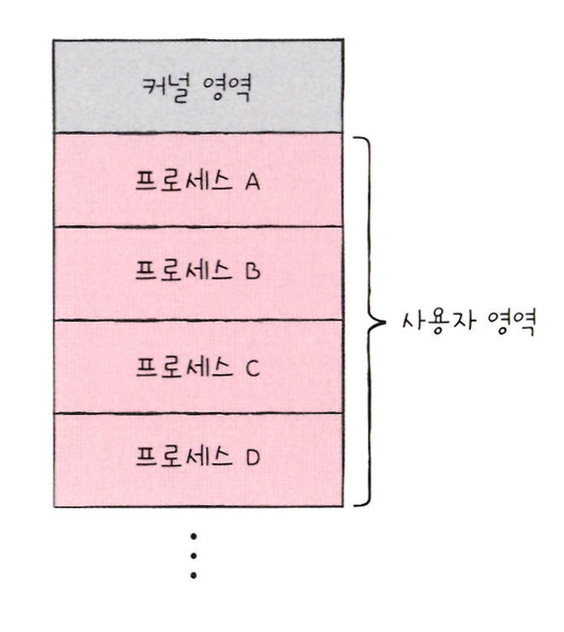
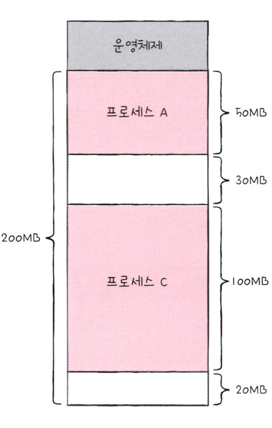

# 연속 메모리 할당

프로세스에 연속적인 메모리 공간을 할당하는 방식을 **연속 메모리 할당**이라고 한다.

## 스와핑

메모리에 적재된 프로세스들 중 현재 실행되지 않는 프로세스들이 존재한다.  
이러한 프로세스들을 임시로 보조기억장치 일부 영역으로 쫓아내고, 그렇게 해서 생긴 메모리의 빈 공간에 또 다른 프로세스를  
적재하여 실행하는 방식을 **스와핑**이라고 한다.

> 이때 프로세스들이 쫓겨나는 보조기억장치의 일부 영역을 **스왑 영역**이라고 하고  
> 현재 실행되지 않는 프로세스가 메모리에서 스왑 영역으로 옮겨지느 것을 **스왑 아웃**, 반대의 경우를 **스왑 인**이라고 한다.

 

## 메모리 할당

비어 있는 메모리 공간에 프로세스를 연속적으로 할당하는 방식에는 **최초 적합, 최적 적합, 최악 적합** 세 가지 방식이 있다.

### 최초 적합

**최초 적합**은 운영체제가 메모리 내 빈 공간을 순서대로 검색하다가 적재할 수 있는 공간을 발견하면 프로세스를 배치하는 방식이다.  
이 방식은 검색을 최소화할 수 있고 빠른 할당이 가능하다.

### 최적 적합

**최적 적합**은 운영체제가 빈 공간을 모두 검색해본 후 가장 작은 공간에 프로세스를 배치하는 방식이다.

### 최악 적합

**최악 적합**은 운영체제가 빈 공간을 모두 검색해본 후 가장 큰 공간에 프로세스를 배치하는 방식이다.

 

## 외부 단편화

프로세스를 메모리에 연속적으로 배치하는 연속 메모리 할당은 **외부 단편화**문제를 가지고 있어, 메모리를 효율적으로 사용하는 방식은 아니다.

위 그림에서 남아있는 메모리 공간은 50MB이지만, 50MB 크기의 프로세스를 적재할 수는 없다.  
이러한 메모리 낭비 현상을 **외부 단편화**라고 한다.

 

## 페이징을 통한 가상 메모리 관리

